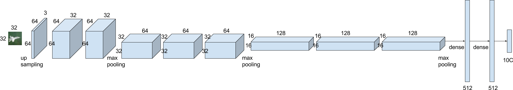

```{r setup, include=FALSE}
knitr::opts_chunk$set(echo = TRUE)
library(knitr)
library(plyr)
library(keras)
library(reshape2)
library(ggplot2)

load(file.path("data", "CIFAR-10","CIFAR-10.RData"))

```

* ### CIFAR-10 - Object Recognition using Keras with Tensorflow

***

    library(plyr)
    library(keras)
    library(reshape2)
    library(ggplot2)
    
***

先前實作<a href="kerasCNN.html" target="_blank">手寫數字</a>的辨識，透過CNN得到不錯的成果，由於MNIST圖像資料為灰階，識別起來比較容易。這次利用<a href="https://www.kaggle.com/c/cifar-10" target="_blank">Cifar10 影像資料</a>，在色彩、雜訊、角度等複雜度都提升，識別難度比MNIST高許多。Cifar10 資料集提供了50000張彩色圖片的訓練資料，大小為32 * 32，共10個類別(飛機、汽車、鳥、貓、鹿、狗、青蛙、馬、船、卡車)，每一類各5000張。我將隨機利用其中40000筆進行訓練，剩下的10000筆為測試資料。以下為自訂的網路架構，將套用不同的學習率(learning rate)、衰變率(decay)及資料擴增(data augmentation)方法，評估各種models的表現

***



***

資料集中的trainLabels.csv包含2個欄位(id 和 label)，利用id欄位(圖片檔名)讀入train資料夾中的png檔

```{r, eval=FALSE}
dir_path <- 'data/CIFAR-10'

data_labels <- read.csv(file.path(dir_path,'trainLabels.csv'), stringsAsFactors = F)

readIMG <- function(filename_v, folder = 'train') {
  img_folder <- folder
  img_arry <- laply(filename_v, function(filename) {
    img <- image_load(file.path(dir_path, img_folder, filename))
    return(image_to_array(img))
  })
  return(img_arry)
}
# 讀入images
images_data <- readIMG(paste0(data_labels[, 1], '.png'))
```

將label標籤轉成數字、one hot encoding處理

```{r, eval=FALSE}
# class 轉數字(從0開始)
num_classes <- 10
images_class <- as.integer(factor(data_labels$label)) - 1

images_class <- to_categorical(images_class, num_classes)

colnames(images_class) <- levels(factor(data_labels$label))
```

隨機取40000筆當作訓練資料、10000筆為測試資料，標準化

```{r, eval=FALSE}
set.seed(777)
index <- sample(nrow(images_data), 0.8 * nrow(images_data))

# data
train_data <- images_data[index,,, ] / 255
test_data <- images_data[-index,,, ] / 255

# class
train_class <- images_class[index,]
test_class <- images_class[-index,]

```

***

由於原圖影像不大(32*32 pixels)，礙於卷積後pooling輸出會更小，首先採up sampling處理，之後再卷積x2、pooling...，資料擴增參數的平移設定為0.2、旋轉角度為10、影像水平翻轉，model批次處理大小固定為128、迭代次數150...

```{r, eval=FALSE}
batch_size <- 128
epochs <- 150
kernel_size <- c(3, 3)

trainCNN <- function(lr, decay, data_Aug) {
  model <- keras_model_sequential()
  
  model %>%
    layer_reshape(target_shape = c(32, 32, 3), input_shape = c(32, 32, 3)) %>%
    layer_upsampling_2d(size = c(2, 2)) %>%
    #64*64
    
    layer_conv_2d(filter = 32, kernel_size = kernel_size, padding = "same") %>%
    layer_activation("relu") %>%
    layer_batch_normalization() %>%
    layer_conv_2d(filter = 32, kernel_size = kernel_size, padding = "same") %>%
    layer_activation("relu") %>%
    layer_batch_normalization() %>%
    layer_max_pooling_2d(pool_size = c(2,2)) %>%
    layer_batch_normalization() %>%
    layer_dropout(0.25) %>%
    #32*32
    
    layer_conv_2d(filter = 64, kernel_size = kernel_size, padding = "same") %>%
    layer_activation("relu") %>%
    layer_batch_normalization() %>%
    layer_conv_2d(filter = 64, kernel_size = kernel_size, padding = "same") %>%
    layer_activation("relu") %>%
    layer_batch_normalization() %>%
    layer_conv_2d(filter = 64, kernel_size = kernel_size, padding = "same") %>%
    layer_activation("relu") %>%
    layer_batch_normalization() %>%
    layer_max_pooling_2d(pool_size = c(2,2)) %>%
    layer_batch_normalization() %>%
    layer_dropout(0.25) %>%
    #16*16
    
    layer_conv_2d(filter = 128, kernel_size = kernel_size, padding = "same") %>%
    layer_activation("relu") %>%
    layer_batch_normalization() %>%
    layer_conv_2d(filter = 128, kernel_size = kernel_size, padding = "same") %>%
    layer_activation("relu") %>%
    layer_batch_normalization() %>%
    layer_max_pooling_2d(pool_size = c(2,2)) %>%
    layer_batch_normalization() %>%
    layer_dropout(0.25) %>%
    #8*8
    
    layer_flatten() %>%
    layer_dense(units = 512) %>%
    layer_activation("relu") %>%
    layer_dropout(0.5) %>%
    layer_dense(units = 512) %>%
    layer_activation("relu") %>%
    layer_dropout(0.5) %>%
    layer_dense(units = num_classes, activation = 'softmax')
  
  # Configure
  model %>% compile(
    loss = "categorical_crossentropy",
    optimizer = optimizer_adam(lr = lr, decay = decay),
    metrics = "accuracy"
  )
  
  result <- NULL
  
  if(data_Aug) {
    # Data Augmentation
    datagen_train <- image_data_generator(
      width_shift_range = 0.2,
      height_shift_range = 0.2,
      rotation_range = 10,
      horizontal_flip = TRUE,
      rescale = (1. / 1)
    )
    datagen_test <- image_data_generator(rescale = (1. / 1))
    
    datagen_train %>% fit_image_data_generator(train_data)
    datagen_test %>% fit_image_data_generator(test_data)
    
    result <- model %>% fit_generator(
      generator = flow_images_from_data(
        train_data,
        train_class,
        datagen_train,
        batch_size = batch_size,
        seed = 777
      ),
      steps_per_epoch = as.integer(dim(train_data)[1] / batch_size),
      epochs = epochs,
      validation_data = flow_images_from_data(
        test_data,
        test_class,
        datagen_test,
        batch_size = batch_size,
        seed = 777
      ),
      validation_steps = as.integer(dim(test_data)[1] / batch_size)
    )
  } else{
    result <- model %>% fit(
      train_data,
      train_class,
      batch_size = batch_size,
      epochs = epochs,
      validation_data = list(test_data, test_class),
      shuffle = TRUE
    )
  }
  
  return(result)
}
```

學習率自訂0.002和0.001，衰變率自訂0和0.0001，資料擴增處理與否，共8種參數組合分別進行訓練

```{r, echo=TRUE}
# grid
expand.grid(lr = c(0.002, 0.001), decay = c(0, 1e-4), data_Aug = c(TRUE, FALSE))

```

***

以下為這8種models的accuracy表現，1 ~ 4有使用資料擴增，5 ~ 8 則沒有使用，可以看出上排有使用的accuracy明顯較高，沒有over fitting，而3、4、7、8有使用衰變率的情形下曲線較平穩

```{r, echo=FALSE}
# plot acc
ggplot(subset(result_df, subset=(metric %in% c('val_acc','acc'))),
       aes(x=epoch , y = value, color = metric)) +
  geom_line(size = 1) +
  labs(x ='epochs', y ='accuracy') +
  facet_wrap( ~ model, nrow = 2) +
  theme(legend.position = 'top') +
  scale_y_continuous(breaks = seq(0, 1 , by =.1))
```

loss值的表現也是1 ~ 4有使用資料擴增者較好

```{r, echo=FALSE}
# plot loss
ggplot(subset(result_df, subset=(metric %in% c('val_loss','loss'))),
       aes(x=epoch , y = value, color = metric)) +
  geom_line(size = 1) +
  labs(x ='epochs', y ='loss') +
  facet_wrap( ~ model, nrow = 2) +
  theme(legend.position = 'top') +
  scale_y_continuous(breaks = seq(0, 3 , by =.5))
```

accuracy 和 loss 前5者，以 model 3居多，model 4則有一次，其中以model 3的第146 epoch表現最佳，accuracy為0.9178485，loss為0.2635953

```{r, echo=TRUE}
# acc top 5
head(arrange(subset(result_df, subset=(metric=='val_acc')), desc(value)), 5)
# loss top 5
head(arrange(subset(result_df, subset=(metric=='val_loss')), value), 5)
```

***

基於以上的表現，使用model 3的參數設定值(lr = 0.002, decay = 0.0001, data_Aug = TRUE)，網路架構除了卷積filter增加2倍，其餘設定不變，重新訓練後(tune model)結果如下。測試的accuracy 前5者有3次超越0.92，loss值前5者則落在0.286 ~ 0.291之間

```{r, echo=FALSE}
# acc top 5
head(arrange(subset(tune_df, subset=(metric=='val_acc')), desc(value)), 5)
# loss top 5
head(arrange(subset(tune_df, subset=(metric=='val_loss')), value), 5)

# plot acc
ggplot(subset(tune_df, subset=(metric %in% c('val_acc','acc'))),
       aes(x=epoch , y = value, color = metric)) +
  geom_line(size = 1) +
  labs(x ='epochs', y ='accuracy') +
  theme(legend.position = 'top') +
  scale_y_continuous(breaks = seq(0, 1 , by =.1))
# plot loss
ggplot(subset(tune_df, subset=(metric %in% c('val_loss','loss'))),
       aes(x=epoch , y = value, color = metric)) +
  geom_line(size = 1) +
  labs(x ='epochs', y ='loss') +
  theme(legend.position = 'top') +
  scale_y_continuous(breaks = seq(0, 2 , by =.25))
```

***

以下是 tune model 預測label和實際測試資料label矩陣，從中約略可看出幾乎預測正確都大於900以上，表示這些準確度應該都有大於0.9以上，除了貓(cat)表現略差，辨識正確者只有785，且容易預測誤判為狗(dog)有141筆。不過狗誤判為貓的錯誤則明顯少非常多，只有30例，此外，鳥誤判為飛機者有37例，其它誤判筆都少於30以下

```{r, echo=FALSE}
table(pred_label, test_label)
```

***

* #### __Summary __

這次實作CNN在彩色影像於分類任務上，使用三個參數調整(八種組合)，從表現上來看，透過資料擴增(data augmentation)和衰變率(decay)的設定，不但提高了辨識的準確度，也減少了overfitting現象。最後，我利用組合中表現最佳的參數設定(lr = 0.002, decay = 0.0001, data_Aug = TRUE)，再增加網路架構中卷積的filter數量，測試的accuracy可以達到0.92，其網路架構參數設定如下

```{r, echo=FALSE}
tune_model <- load_model_hdf5(file.path("data", 'CIFAR-10','CIFAR-10.hdf5'))
summary(tune_model)
```

***

* ### Lessons Learned:
    + #### Learning Rate
    + #### Learning Rate Decay
    + #### Data Augmentation
    + #### Batch Normalization


