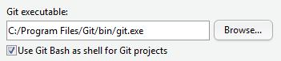
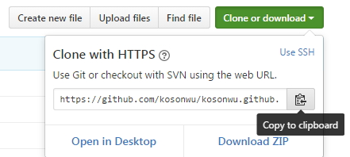
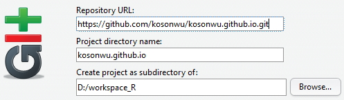
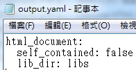

```{r setup, include=FALSE}
knitr::opts_chunk$set(echo = TRUE)
```

* ### create a website through RStudio

***

1. 下載安裝 [Git](https://git-scm.com/downloads)，在 RStudio > Tools > Global Options 設定 Git/SVN.

    

***

2. 在 Github 完成註冊並 New repository ， Repository name 輸入你的帳號.github.io
( ex:kosonwu.github.io )

***

3. 在新建的 repository 中， Use HTTPS 並 Copy to clipboard 

    

***

4. 在 RStudio 建立一個 Version Control 的新專案，在 Repository URL 中貼上

    

***

5. RStudio 與 Git 認證
    + `在 RStudio 專案中開啟 Tools > Shell 並輸入以下 command`
    + `git config --global user.name "你的 Git 帳號"`
    + `git config --global user.email "你的 Email 帳號"`

***

6. 下載 [RStudio Markdown website template](https://raw.githubusercontent.com/rstudio/rmarkdown-website/master/_navbar.html) 並置放在 RStudio 專案目錄中
    + `可在 Tools > Shell 輸入 wget --no-check-certificate 指令下載 or 直接另存新檔`

***

7. 避免 Git system 的追蹤，編輯 RStudio 專案目錄中 .gitignore ，加入
    + `.rproj`
    + `.Rproj`
    + `kosonwu.github.io.Rproj`

***

8. 下載 [RStudio Makefile](https://github.com/rstudio/rmarkdown-website/blob/master/Makefile) 並置放在 RStudio 專案目錄中 ( for website 建立用 )

***

9. 在 RStudio 專案目錄中建立 output.yaml 並輸入

     

***

10. 加入 website 首頁
    + `在 RStudio 新增 R Markdown 並命名 index.rmd `
    + `編輯 rmd 內容完成後，Knit 輸出 HTML`
    + `確認檔案內容無誤後 Commit、Push`
    + `Navigating to your website` <http://your_account_name.github.io>.
    
***

* ### Lesson learn:
    + #### Create a website.
    + #### Git version control.
    + #### R Markdown output format.

