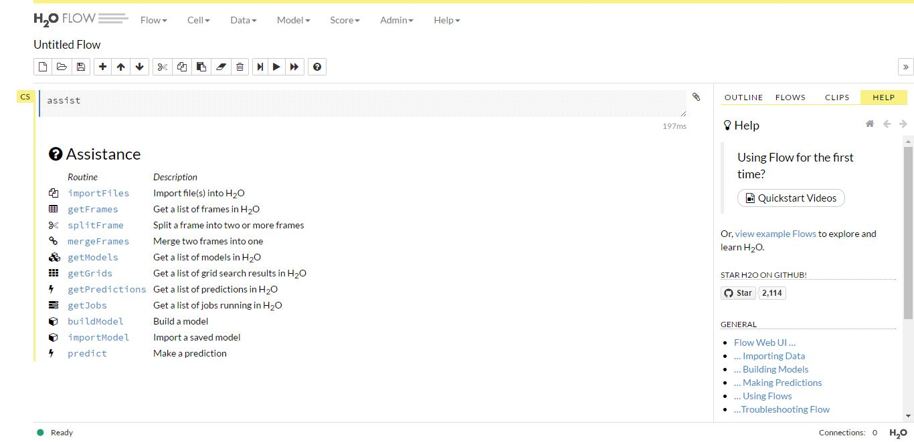

```{r setup, include=FALSE}
knitr::opts_chunk$set(echo = TRUE)
library(knitr)
library(h2o)
library(plyr)
library(ggplot2)

load(file.path("data", "digit_recognizer", ".RData"))
```

* ### handwritten	digits recognizer with deep learning - MNIST Data 

***

    library(h2o)
    library(plyr)
    library(ggplot2)
    
***

這篇將實作深度學習於手寫數字的辨識，利用著名的 MNIST 資料集，可直接從 kaggle 網站 <a href="https://www.kaggle.com/c/digit-recognizer" target="_blank">Digit Recognizer</a> 下載，訓練資料共 42000 筆、785 個欄位(1個label、784個pixels)，將利用這些資料訓練、建模和預測。這次介紹的重點在於 Computer Vision(CV) 基本處理及 Deep Learning 的應用(利用H2O套件)，它有 Multi CPU、Cluster 運算和 Auto-Encoder，但沒有支援CNN、RNN，因此這篇主要以DNN方法為主...

***

* #### __Quick-Start __

H2O的核心碼是Java，因此R套件h2o在安裝前必須先安裝JVM和JDK，考量後續的執行效能，建議安裝64 bit的，待一切備妥後，透過下列指令啟動H2O server，nthreads = -1 表示將使用多核運算。啟動之後，預設可以透過瀏覽器輸入網址 http://127.0.0.1:54321 查看H2O FLOW，這是一個很棒的web操作介面(如下圖)，從檔案的匯入、資料框架的查看和異動、模型的匯入建立等等，都可以透過介面完成

```{r, eval=FALSE}
# using	all	your cores
h2o.init(nthreads = -1)

```


***

H2O有自己的H2O Frame，它是在H2O Server裡進行運算的(不是在R的client)，概念上和Spark很相似，透過 h2o.importFile 可以直接將檔案匯入轉成 H2O Frame，由於我把H2O安裝在單機，考量硬體效能及匯入後加工處理的便利性，這裡還是先以 read.csv 讀入檔案...後續再利用 as.h2o 來轉換

```{r, eval=FALSE}
# 匯入
train_data <- read.csv(file.path("data", "digit_recognizer","train.csv"), stringsAsFactors = F)
train_data$label <- as.factor(train_data$label)
```

***

* #### __Take A Look __

這案例除了應用深度學習來分類之外，另一個重點在於基本CV的練習，由於原始資料已經很乾淨了，甚至沒有missing data，因此接下來除了一窺原始pixels的圖片，我也利用減少一列(欄)進行上下左右移動再平均的做法，當作和原始資料應用上的比較

```{r, eval=FALSE}
# 移動平均
moveAVG <- function(row_df){
  row_vt <- as.vector(as.matrix(row_df))
  reflected_mx <- matrix(row_vt, 28, 28)
  img_mx <- reflected_mx[, 28:1]
  # ---
  # 位移1row,1col
  zoro_r <- matrix(0, nrow = 1, ncol = 28)
  zoro_c <- matrix(0, nrow = 28, ncol = 1)
  # move up + move down
  img_up <- rbind(img_mx[-1, ], zoro_r) 
  img_dw <- rbind(zoro_r, img_mx[-28, ])
  img_Ver <- (img_up + img_dw) / 2
  # move left + move right
  img_lt <- cbind(img_mx[,-1], zoro_c)
  img_rt <- cbind(zoro_c, img_mx[,-28])
  img_Hor <- (img_lt + img_rt) / 2
  # 合併平均
  img_Move <- (img_Ver + img_Hor ) / 2
  return(as.vector(img_Move[,28:1]))
}

train_moveAVG <- apply(train_data[,-1], 1, moveAVG)
train_moveAVG <- t(train_moveAVG)
# add label
train_moveAVG <- data.frame(label=train_data[,1], train_moveAVG)
```

以前10筆資料為例，上列是原始pixels的圖片，下列是上下左右移動再平均後的圖片

```{r, echo=FALSE}
num_imgs <- 10
# bottom, left, top, right
par(mar=c(0,0,0,0))
layout(matrix(1:(num_imgs*2), 2, byrow = F))
for(i in seq_len(num_imgs)){
  showDigit(train_data[i, -1], "o")
  showDigit(train_moveAVG[i, -1], "o")
}
```

***

* #### __Experiments (DNN) __

接下來針對以上2種資料來實驗，試試DNN的分類成效，訓練和測試資料比為8:2，每一種資料將實驗2次，一次採預設參數、一次採用自訂的tuning參數，為了後續重複使用，實驗函式如下

```{r, eval=FALSE}
# deep learning
startDL <- function(h2odata_v) {
  result_df = ldply(h2odata_v, function(h2odata) {
    y <- "label"
    x <- setdiff(names(h2odata),	y)
    parts <- h2o.splitFrame(h2odata,	0.8, seed=777)
    train <- parts[[1]]
    test <- parts[[2]]
    # default
    t1 = Sys.time()
    m_D <- h2o.deeplearning(x, y,	train, model_id	=	"DL:200*200_10", seed = 777)
    mse_D = h2o.mse(m_D)
    p_D <- h2o.predict(m_D,	test)
    acc_D = mean(test$label == p_D$predict)
    # tuning
    m_T <- h2o.deeplearning(x, y, train, model_id	=	"DL:500*300_50", distribution = "multinomial", 
                            sparse = T, epochs = 50, seed = 777, l1	=	0.00001,
                            input_dropout_ratio	=	0.25, 	hidden_dropout_ratios	=	c(0.5, 0.3), 
                            activation = "RectifierWithDropout", hidden = c(500, 300))
    mse_T = h2o.mse(m_T)
    p_T <- h2o.predict(m_T,	test)
    acc_T = mean(test$label == p_T$predict)
    print(difftime(Sys.time(), t1, units = 'mins'))
    
    return(c(mse_default = mse_D,  acc_default = acc_D, mse_tuning = mse_T, acc_tuning = acc_T))
  })
  return(result_df)
}
```

將原始資料及移動後的平均資料轉成H2O Frame，進行第一次的DNN實驗，結果第一列為使用原始資料、第二列則是使用移動後的平均資料，從下面的結果看來，第一列無論是預設或tuning參數所得的mse都比較低(好)，不過在accuracy表現上，第一列和第二列都差不多，不過兩者在tuning參數下所得的accuracy都比使用預設的高(約1%)

```{r, eval=FALSE}
h2o_t0 <- as.h2o(train_data)
h2o_t1 <- as.h2o(train_moveAVG)
performance <- startDL(list(h2o_t0, h2o_t1))
```

```{r, echo=FALSE}
performance
```

***

* #### __Experiments (DNN + Feature Engineering) __

由於上面所得到accuracy相近，接下來繼續透過基本CV方法來增加資料的features，看看能否有所改善。首先，增加avgBlock函式，針對所傳入的matrix進行block的平均，以4x4 grid為例，將可以得到49個features (784/16)

```{r, eval=FALSE}
# 平均block值, default 2x2 grid
avgBlock <- function(data_mx, n = 2) {
  index <- n
  limt <- sqrt(length(as.vector(data_mx)))
  mb <- c()
  
  for (k in seq(1, limt, by = index)) {
    for (i in seq(1, limt, by = index)) {
      k2 <- k + index - 1
      i2 <- i + index - 1
      if (i2 <= limt && k2 <= limt) {
        avg = mean(data_mx[i:i2, k:k2])
        mb <- c(mb, avg)
      }
    }
  }
  return(mb)
}
```

另外，考量列、欄的平均值在不同數字上有所分別，以下採用2列、欄的平均做為新增的features，這樣又可以產生28個(14+14)

```{r, eval=FALSE}
# 添加img features
addFeatures <- function(row_df){
  row_vt <- as.vector(as.matrix(row_df))
  reflected_mx <- matrix(row_vt, 28, 28)
  img_mx <- reflected_mx[, 28:1]
  # 2 col,row 平均
  avg2c_mv <- sapply(seq(1, 28, by = 2), function(i) mean(img_mx[i:i+1,]))
  avg2r_mv <- sapply(seq(1, 28, by = 2), function(i) mean(img_mx[,i:i+1]))

  # 平均 grid nxn 產生block
  mean_block <- avgBlock(img_mx, 4)
  
  return(c(avg2c_mv, avg2r_mv, mean_block))
}
```

接著，將原始和移動後的平均資料分別帶入上述函式，將產生共77個新的features，然後將這些併入原本的資料中，資料維度將增加到862(785+77)，後續利用這些資料來實驗

```{r, eval=FALSE}
train_data_add <- apply(train_data[,-1], 1, addFeatures)
train_data_add <- t(train_data_add)
dim(train_data_add)

train_moveAVG_add <- apply(train_moveAVG[,-1], 1, addFeatures)
train_moveAVG_add <- t(train_moveAVG_add)

# 添加features
h2o_t0_add <- as.h2o(cbind(train_data, train_data_add))
dim(h2o_t0_add)

h2o_t1_add <- as.h2o(cbind(train_moveAVG, train_moveAVG_add))
```

```{r, echo=FALSE}
dim(train_data_add)
dim(h2o_t0_add)
```

以原始資料前10筆為例，第2、3列是欄和列平均圖片，第4列是block(4x4 grid)的平均圖片

```{r, echo=FALSE}
num_imgs <- 10
# bottom, left, top, right
par(mar=c(0,0,0,0))
layout(matrix(1:(num_imgs*4), 4, byrow = F))
for(i in seq_len(num_imgs)){
  nc = ncol(train_data_add)
  showDigit(train_data[i, -1], "o")
  showDigit(train_data_add[i, 1:14], "c")
  showDigit(train_data_add[i, 15:28], "r")
  showDigit(train_data_add[i, 29:nc])
}
```

接著，針對這些資料分別DNN實驗，performance2 是原始資料+新features實驗結果，第一列是使用813個(785+28)features的結果，第二列是862個(785+28+49)features結果

```{r, eval=FALSE}
# 原始img
performance2 <- startDL(list(h2o_t0_add[, 1:813], h2o_t0_add))
# moveAVG img
performance3 <- startDL(list(h2o_t1_add[, 1:813], h2o_t1_add))
```

```{r}
performance2
```

performance3 是移動後平均資料+新features實驗結果。從以上結果看來，performance2 利用原始資料透過這些方法所增加的features並未帶來更佳的accuracy，結果和第一次的實驗差不多。反觀performance3 和其第一次實驗相比，透過增加 features的做法，在這次實驗中得到較佳的 accuracy (0.9815796)，而且和 performance2 相比，無論在使用預設或tuning參數上，其表現都比較好。因此，接下來的實驗，將以移動後平均資料+新features的資料做為base

```{r}
performance3
```

***

* #### __Experiments (DNN + Feature Engineering + Auto-Encoder) __

前面提到H2O有支援Auto-Encoder，將autoencoder參數設為True即可使用，為了稍後繪圖查看，先自訂1層hidden layer 2個nodes，activation 參數設為Tanh(-1至1之間)

```{r, eval=FALSE}
y <- "label"
x <- setdiff(names(h2o_t1),	y)
# Auto-Encoder: True
#2
model_2_AE <- h2o.deeplearning(x, training_frame = h2o_t1, autoencoder = T, hidden = c(2), 
                             epochs = 50, activation = 'Tanh', seed = 777)
h2o.mse(model_2_AE)
feature_2_AE <- h2o.deepfeatures(model_2_AE,	h2o_t1,	layer	=	1)
head(feature_2_AE)
```

model得到的mse和Auto-Encoder產生的2個features如下(前6筆資料)，看起來有點像是PCA、MDS概念，將784個features以2維來表示，不過Auto-Encoder會以比較平等方式來對待每個features，不像PCA的主成份通常cover了多數的features

```{r, echo=FALSE}
h2o.mse(model_2_AE)
head(feature_2_AE)
```

將產生的2維資料繪圖查看，很明顯的有些label確實集中在特定區域，表示這2個新features具有一些意涵

```{r, echo=FALSE}
ggplot(train_autoEncoder, aes(x=DF.L1.C1, y=DF.L1.C2)) + 
  geom_point(aes(color=label)) +
  labs(x='', y='', title='Auto-Encoder')
```

此外，也加入hidden layer size為5和10試試，其 mse 隨著size的增加而減少

```{r, eval=FALSE}
#5
model_5_AE <- h2o.deeplearning(x, training_frame = h2o_t1, autoencoder = T, hidden = c(5), 
                             epochs = 50, activation = 'Tanh', seed = 777)
h2o.mse(model_5_AE)
feature_5_AE <- h2o.deepfeatures(model_5_AE,	h2o_t1,	layer	=	1)
```

```{r, echo=FALSE}
h2o.mse(model_5_AE)
```

```{r, eval=FALSE}
#10
model_10_AE <- h2o.deeplearning(x, training_frame = h2o_t1, autoencoder = T, hidden = c(10), 
                               epochs = 50, activation = 'Tanh', seed = 777)
h2o.mse(model_10_AE)
feature_10_AE <- h2o.deepfeatures(model_10_AE,	h2o_t1,	layer	=	1)
```

```{r, echo=FALSE}
h2o.mse(model_10_AE)
```

最後，將這些Auto-Encoder產生的features加入，資料維度分別為864、867及872

```{r, eval=FALSE}
h2o_t1_add2AE <- h2o.cbind(h2o_t1_add, feature_2_AE)
h2o_t1_add5AE <- h2o.cbind(h2o_t1_add, feature_5_AE)
h2o_t1_add10AE <- h2o.cbind(h2o_t1_add, feature_10_AE)

dim(h2o_t1_add2AE)
dim(h2o_t1_add5AE)
dim(h2o_t1_add10AE)
```

```{r, echo=FALSE}
dim(h2o_t1_add2AE)
dim(h2o_t1_add5AE)
dim(h2o_t1_add10AE)
```

再次進行DNN，從結果看來，本次第三列的結果最佳，tuning參數下的accuracy為0.9823020

```{r, eval=FALSE}
performance4 <- startDL(list(h2o_t1_add2AE, h2o_t1_add5AE, h2o_t1_add10AE))
```

```{r, echo=FALSE}
performance4
```

***

* #### __Summary __

下表是上述幾次實驗較佳結果的彙整，第一列是使用移動後的平均資料(維度785)的結果，第二列是加入列欄和block平均資料(維度862)，第三列是再加入Auto-Encoder產生的10個features的資料(維度872)。從這次結果來看，經由這樣方法將accuracy由0.9797737提升至0.9823020，雖然使用的CV方法很陽春，不過藉由features的增加也帶來些微的改善，其結果都比使用原始資料來的好。此外，Auto-Encoder 的設定調整也帶來些微的幫助，不排除設定其他hidden layer size會更好，而這幾次tuning參數下的表現都比使用預設值來的好。

這次實作了基本CV處理和H2O的DNN、Auto-Encoder，0.982的準確率看似不錯，但還是有改善的空間，不過最重要的是實作過程得到的啟發，下次將練習不同做法(如Ensemble方法)或是採用不同的Deep Learning套件(如Keras的CNN)，學海無涯，Learning by doing.

```{r, echo=FALSE}
mysummary <- rbind(performance[2,], performance3[2,], performance4[3,])
kable(mysummary)
```

***

* ### Lessons Learned:
    + #### Computer vision fundamentals
    + #### Deep Learning (H2O)
    + #### Auto-Encoder