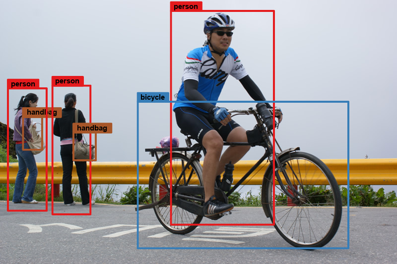
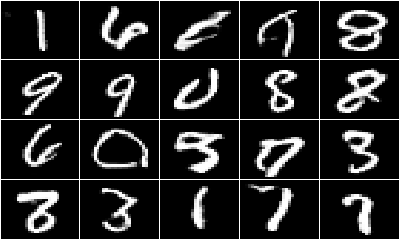

```{r setup, include=FALSE}
knitr::opts_chunk$set(echo = TRUE)
```

***
<br/> | <br/>
----------------------------------------------------- | -------------------------------------------------------------------------
 | <a href="./ArbitraryStyleTransfer.html"> Arbitrary Style Transfer in Real-time with AdaIN. <br/><br/> 以 Keras 實現 任意風格移轉 in Real-time.</a> <br/><br/> ( *2020-06-05* )

***
<br/> | <br/>
----------------------------------------------------- | -------------------------------------------------------------------------
 | <a href="./DFC_CVAE.html"> Deep feature consistent conditional variational autoencoder (DFC CVAE) in Keras. <br/><br/> 以 Keras 實現 DFC CVAE，使用 CelebA 資料集.</a> <br/><br/> ( *2019-07-08* )
   
***
<br/> | <br/>
----------------------------------------------------- | -------------------------------------------------------------------------
 | <a href="./vgg16Visualizing.html"> Visualizing what convnets of VGG16 learn. <br/><br/> 可視化 VGG16 卷積網路學習的內容.</a> <br/><br/> ( *2019-04-01* )

***
<br/> | <br/>
----------------------------------------------------- | -------------------------------------------------------------------------
 | <a href="./PilotUnionStrike.html"> Plotting cancelled/delay flight paths at pilot union strike. <br/><br/> 繪製華航罷工事件影響航班的飛行路徑.</a> <br/><br/> ( *2019-02-19* )

***
<br/> | <br/>
----------------------------------------------------- | -------------------------------------------------------------------------
 | <a href="./yolov2.html"> Implement a pre-trained YOLOv2 model - object detection. <br/><br/> 實現物體偵測，利用 pre-trained YOLOv2 model.</a> <br/><br/> ( *2018-06-05* )

***
<br/> | <br/>
----------------------------------------------------- | -------------------------------------------------------------------------
 | <a href="./carvana.html"> Carvana Image Masking - Semantic Segmentation using Keras. <br/><br/> 使用 Keras 影像分割，自動去除 Carvana 影像背景.</a> <br/><br/> ( *2018-04-23* )

***
<br/> | <br/>
----------------------------------------------------- | -------------------------------------------------------------------------
 | <a href="./voc2012.html"> VOC2012 - Semantic Segmentation using Keras with Tensorflow. <br/><br/> 以 FCN 實現 VOC2012 語義分割，使用Keras和Tensorflow.</a> <br/><br/> ( *2017-11-18* )

***
<br/> | <br/>
----------------------------------------------------- | -------------------------------------------------------------------------
 | <a href="./cifar10.html"> CIFAR-10 - Object Recognition using Keras with Tensorflow. <br/><br/> CIFAR-10影像辨識，使用Keras和Tensorflow.</a> <br/><br/> ( *2017-10-12* )

***
<br/> | <br/>
----------------------------------------------------- | -------------------------------------------------------------------------
 | <a href="./movieReviewCNN.html"> Implementation of MLP, RNN and CNN on movie reviews sentiment analysis. <br/><br/> 實作MLP、RNN及CNN於電影評論情感分析.</a> <br/><br/> ( *2017-09-26* )

***
<br/> | <br/>
----------------------------------------------------- | -------------------------------------------------------------------------
 | <a href="./kerasGAN.html"> Generative adversarial networks (GAN) on the MNIST dataset. <br/><br/> 實作生成對抗網路GAN自動生成手寫數字.</a> <br/><br/> ( *2017-08-08* )

***
<br/> | <br/>
----------------------------------------------------- | -------------------------------------------------------------------------
 | <a href="./kerasCNN.html"> Convolutional neural networks (CNN) on the MNIST dataset. <br/><br/> 利用Keras實作CNN於手寫數字的辨識.</a> <br/><br/> ( *2017-06-21* )

***
<br/> | <br/>
----------------------------------------------------- | -------------------------------------------------------------------------
 | <a href="./digitRecognizer.html"> Handwritten digits recognizer with deep learning - MNIST Data. <br/><br/> 利用H2O深度學習DNN於手寫數字的辨識.</a> <br/><br/> ( *2017-06-15* )

***
<br/> | <br/>
----------------------------------------------------- | -------------------------------------------------------------------------
 | <a href="./sentimentAnalysis.html"> Sentiment scores of movie reviews. <br/><br/> 使用 simple matching 分析電影評論情感分數.</a> <br/><br/> ( *2017-05-12* )

***
<br/> | <br/>
----------------------------------------------------- | -------------------------------------------------------------------------
 | <a href="./movieReviewSentiment.html"> Movie reviews sentiment analysis - Bag of Words Meets Bags of Popcorn. <br/><br/> 情感分析 - 電影評論正負極性.</a> <br/><br/> ( *2017-04-22* )

***
<br/> | <br/>
----------------------------------------------------- | -------------------------------------------------------------------------
 | <a href="./stspMailTopics.html"> Eextracting the topics with LDA. <br/><br/> 使用 LDA 擷取主題 - 以網站意見信箱為例.</a> <br/><br/> ( *2017-03-14* )

***
<br/> | <br/>
----------------------------------------------------- | -------------------------------------------------------------------------
 | <a href="./stspMailService.html"> Text classification in opinion mining of the website. <br/><br/> 文本分類應用 - 以網站意見信箱為例.</a> <br/><br/> ( *2017-03-03* )

***
<br/> | <br/>
----------------------------------------------------- | -------------------------------------------------------------------------
 | <a href="./kaoCityBike.html"> Thematic maps of Kaohsiung city public bike. <br/><br/> 利用 tmap 套件產出主題地圖 - 以高雄市公共腳踏車為例.</a> <br/><br/> ( *2017-01-25* )

***
<br/> | <br/>
----------------------------------------------------- | -------------------------------------------------------------------------
 | <a href="./associationRules.html"> Exploring association rules with Apriori. <br/><br/> 運用 Apriori 產生關聯規則.</a> <br/><br/> ( *2017-01-18* )

***
<br/> | <br/>
----------------------------------------------------- | -------------------------------------------------------------------------
 | <a href="./logisticRegression.html"> Logistic regression with Artpiece data. <br/><br/> 邏輯迴歸分析 - glm.</a> <br/><br/> ( *2017-01-13* )

***
<br/> | <br/>
----------------------------------------------------- | -------------------------------------------------------------------------
 | <a href="./linearRegression.html"> Multiple linear regression analysis. <br/><br/> 多元線性迴歸分析 - 使用Cars93資料集.</a> <br/><br/> ( *2017-01-05* )

***
<br/> | <br/>
----------------------------------------------------- | -------------------------------------------------------------------------
 | <a href="./exerciseSparkR.html"> Data exploration with SparkR 2.0.2. <br/><br/> 使用 SparkR 2.0.2 進行數據探索.</a> <br/><br/> ( *2016-12-15* )

***
<br/> | <br/>
----------------------------------------------------- | -------------------------------------------------------------------------
 | <a href="./ensembleBoosting.html"> Boosting in ensembles using the caret package. <br/><br/> Ensemble modeling，以 GBM (Gradient Boosted Machine) 和 XGBoost (eXtreme Gradient Boosting) 為例.</a> <br/><br/> ( *2016-12-13* )

***
<br/> | <br/>
----------------------------------------------------- | -------------------------------------------------------------------------
 | <a href="./classifyWhiskies.html"> Cross-validation and classification using the caret package. <br/><br/> 使用 caret 套件交叉驗證、分類學習，以 C5.0, Neural Networks, SVM, Naive Bayes, Random Forests and k-NN 為主.</a> <br/><br/> ( *2016-11-25* )

***
<br/> | <br/>
----------------------------------------------------- | -------------------------------------------------------------------------
 | <a href="./mdsWhiskies.html"> Scotch whiskies flavour mapping with MDS. <br/><br/> 利用 MDS 方法繪製 Scotch Whiskies Flavour Map. </a> <br/><br/> ( *2016-11-21* )

***
<br/> | <br/>
----------------------------------------------------- | -------------------------------------------------------------------------
 | <a href="./pcaWhiskies.html"> Scotch whiskies flavour mapping with PCA. <br/><br/> 利用 PCA 方法繪製 Scotch Whiskies Flavour Map. </a> <br/><br/> ( *2016-11-14* )

***
<br/> | <br/>
----------------------------------------------------- | -------------------------------------------------------------------------
 | <a href="./kmeansWhiskies.html"> K-means cluster analysis of scotch whiskies. <br/><br/> Extract 網頁資訊、利用 K-means 分群法對 Scotch Whiskies 進行分群、以 Google Map 展現. </a> <br/><br/> ( *2016-11-08* )

***
<br/> | <br/>
----------------------------------------------------- | -------------------------------------------------------------------------
 | <a href="./createWebsite.html"> Create a website through RStudio. <br/><br/> 利用 RStudio 進行 Git 版本控管、R Markdown 產出 HTML 網頁至 Github. </a> <br/><br/> ( *2016-11-03* )

***
