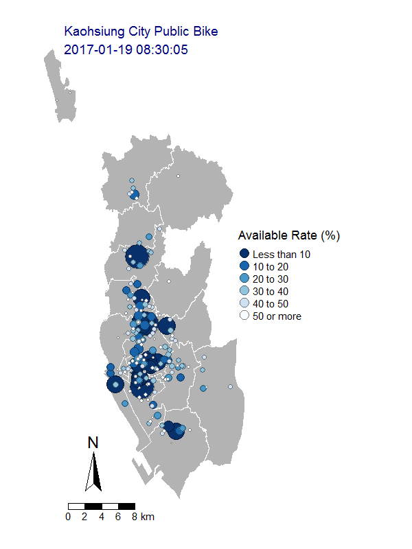
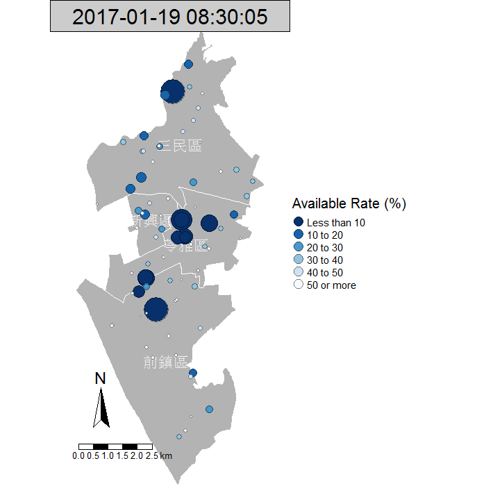

```{r setup, include=FALSE}
knitr::opts_chunk$set(echo = TRUE)
library(knitr)
library(sp)
library(tmap)
library(tmaptools)
library(plyr)
library(dplyr)
library(ggplot2)
library(lubridate)
# 載入
kaoBike <- read.csv(file.path("data", "kaoBike.csv"), stringsAsFactors = F, header = F)
colnames(kaoBike) <- c('sID', 'sNO', 'sName', 'Lat', 'Lon', 'stock',
                       'space', 'avRate', 'Alert', 'relativeIndex', 'Dtime')
# 轉POSIXct
kaoBike$Dtime <- as.POSIXct(kaoBike$Dtime)
# 每隔10分
kaoBike <- kaoBike[minute(kaoBike$Dtime) %in% seq(0,50,by=10),]

# 可租率
kaoBike$avRate <- with(kaoBike, stock / (stock + space)) * 100
# 可租率低於1成的站
kaoBike$Alert <- ifelse(kaoBike$avRate < 10, kaoBike$sName, NA)

# 建立 bike SpatialPointsDataFrame of known locations
SPT <- kaoBike
#library("sp", lib.loc="C:/Program Files/R/R-3.3.1/library")
# create a Spatial object
coordinates(SPT) <- ~ Lon + Lat
#library("tmap", lib.loc="C:/Program Files/R/R-3.3.1/library")
SPT <- set_projection(SPT, current.projection = 'longlat', projection = 'hd')
get_projection(SPT)

# 建立高雄行政區地圖
# download districts borders of KaoHsiung from http://data.gov.tw/node/7441
TW <- read_shape(file = file.path("data", "tw_county3", "TOWN_MOI_1051214.shp"), 
                    encoding = 'UTF-8', use_iconv=T)
kaoMAP <- TW[which(TW$COUNTYNAME == "高雄市"),]
kaoMAP <- set_projection(kaoMAP, projection = 'hd')
get_projection(kaoMAP)

# retrieves KaoHsiung attributes into SPT
spatial.kao <- over(SPT, kaoMAP)
SPT <- SPT[!is.na(spatial.kao$TOWNNAME),]

# remove bike 沒用到的行政區
bikeMAP <- kaoMAP[which(kaoMAP$TOWNNAME %in% unique(as.character(spatial.kao$TOWNNAME))),]
bikeMAP <- set_projection(bikeMAP, projection = 'hd')
get_projection(bikeMAP)

# check 筆數無誤後合併
kaoBikeALL <- cbind(kaoBike, spatial.kao)

kaoTOWN <- kaoBikeALL[,c(15,11,8)]
kaoTOWN.avg <- ddply(kaoTOWN, .(Dtime, TOWNNAME), function(x) colMeans(x[3]))
colnames(kaoTOWN.avg)[3] <- 'avRate.Avg'

TN <- '苓雅區'
DT <- '2017-01-19'
```

* ### thematic maps of Kaohsiung city public bike

***

    library(sp)
    library(tmap)
    library(tmaptools)
    library(plyr)
    library(dplyr)
    library(ggplot2)
    library(lubridate)

    sp：空間數據處理套件
    tmap & tmaptools：地圖套件及相關工具
    plyr & dplyr：數據操作(Data Manipulation)工具
    ggplot2：繪圖及空間可視化
    lubridate：日期時間處理套件
    
***

主題地圖( thematic map )是呈現空間數據的一種方法，這次練習的資料來源為<a href="http://www.c-bike.com.tw/" target="_blank">高雄市公共腳踏車資訊網</a>，網站中有提供<a href="http://www.c-bike.com.tw/xml/stationlistopendata.aspx" target="_blank">即時更新的XML</a>，以下做法是利用排程套件 taskscheduleR 從 8:30 至 18:00 ，每10分鐘擷取、解析，得到資料共 10846 筆，資料結構如下：sID 是原 XML 的 StationID，sNO 是 StationNO，sName 是 StationName，Lat 是 StationLat，Lon 是 StationLon，stock 是 StationNums1(目前數量)，space 是 StationNums2(尚餘空位)，avRate 是自訂的可租率，公式:stock / (stock + space)，Alert 是可租率低於1成時的 Station 名稱，relativeIndex 是自訂的相對比率，加強目前數量和尚餘空位的對比，公式:1 / ((stock + 1) / (space + 1))，Dtime 是資料擷取時的日期時間

```{r}
str(kaoBike)
```

***

首先，利用 sp 套件以經緯度建立公共腳踏車數據的空間物件(SpatialPointsDataFrame)，接著利用 tmaptools 套件設定其 projection

```{r, eval=FALSE}
# 建立 bike SpatialPointsDataFrame of known locations
SPT <- kaoBike
coordinates(SPT) <- ~ Lon + Lat
SPT <- set_projection(SPT, current.projection = 'longlat', projection = 'hd')
get_projection(SPT)
```

```{r, echo=FALSE}
get_projection(SPT)
```

***

地圖的部份，使用各鄉(鎮、市、區)行政區域界線圖資，從<a href="http://data.gov.tw/node/7441" target="_blank">政府資料開放平台</a>下載，讀入 shapefile 之後留下高雄市的部份並重設 projection ，然後繪出高雄市地圖確認

```{r, eval=FALSE}
# 建立高雄行政區地圖
# download districts borders of KaoHsiung from http://data.gov.tw/node/7441
TW <- read_shape(file = file.path("data", "tw_county3", "TOWN_MOI_1051214.shp"), 
                    encoding = 'UTF-8', use_iconv=T)
kaoMAP <- TW[which(TW$COUNTYNAME == "高雄市"),]
kaoMAP <- set_projection(kaoMAP, projection = 'hd')
get_projection(kaoMAP)
qtm(kaoMAP)
```

```{r, echo=FALSE}
get_projection(kaoMAP)
qtm(kaoMAP)
```

***

接著，整合公共腳踏車空間物件與高雄地圖的資訊，利用 sp 套件 over 方法，將高雄地圖中有的資訊(ex:行政區)擷取整合(類似 join 的概念)。由於並非所有行政區都有公共腳踏車的 Station，利用整合後的資訊進行過濾，重設 projection 後繪出有公共腳踏車的行政區地圖來查看

```{r, eval=FALSE}
# retrieves KaoHsiung attributes into SPT
spatial.kao <- over(SPT, kaoMAP)
# remove bike 沒用到的行政區
bikeMAP <- kaoMAP[which(kaoMAP$TOWNNAME %in% unique(as.character(spatial.kao$TOWNNAME))),]
bikeMAP <- set_projection(bikeMAP, projection = 'hd')
get_projection(bikeMAP)
tm_shape(bikeMAP) + tm_fill("grey70") + tm_borders(col = 'white') +
  tm_text("TOWNNAME", size = 0.7)
```

```{r, echo=FALSE}
get_projection(bikeMAP)
tm_shape(bikeMAP) + tm_fill("grey70") + tm_borders(col = 'white') +
  tm_text("TOWNNAME", size = 0.7)
```

***

有了整合後的 spatial.kao 資訊，在與公共腳踏車數據 kaoBike 確認筆數無誤後合併，成為最後要使用的資料來源。首先，利用它來了解一下高雄各行政區的平均可租率，紅色虛線是自訂的警示線，低於此線可能面臨缺車，不過由於各區 Station 數量及公共腳踏車租借情形不一，從各區平均可租率看來似乎還好

```{r, echo=FALSE}
#library("ggplot2", lib.loc="C:/Program Files/R/R-3.3.1/library")
ggplot(kaoTOWN.avg, aes(x = Dtime,y = avRate.Avg)) +
  geom_line(col= "green") +
  facet_wrap( ~ TOWNNAME, nrow = 5, ncol = 4) +
  geom_hline(yintercept = 10, color = 'red', linetype = "dashed") +
  theme(strip.background = element_rect(fill = "black", colour = "white"), 
        strip.text = element_text(colour = "white"),
        panel.background = element_rect(fill = "black", colour = "white"),
        panel.grid.major = element_line(colour = "grey20"),
        panel.grid.minor = element_line(colour = "grey20"),
        axis.text = element_text(colour = "darkblue", face = "bold"),
        plot.title = element_text(size = rel(1.5))) +
  scale_y_continuous(breaks = seq(10, 90, by = 20)) +
  labs(title = paste(DT,'Average Available Rate of Kaohsiung City Public Bike'), 
       x = 'Time', y = 'Average Available Rate (%)') +
  theme(axis.text.x = element_text(angle = 45)) 
```

19 個行政區公共腳踏車 Station 數量如下，最多的是左營區有 25 個、最少的是燕巢區 1 個

```{r, echo=FALSE}
kable(rbind(table(as.character(distinct(kaoBikeALL, TOWNNAME, sName)$TOWNNAME))))
```

***

以苓雅區為例，有 20 個 Station ，個別的可租率分佈如下圖，可以用來了解每個 Station 在不同時段公共腳踏車使用情形，做為車輛調度改善的參考

```{r, echo=FALSE}
ggplot(filter(kaoBikeALL[,c(15,11,8,3)], TOWNNAME==TN), aes(x = Dtime,y = avRate)) +
  geom_line(col= "green") +
  facet_wrap( ~ sName, nrow = 5, ncol = 4) +
  geom_hline(yintercept = 10, color = 'red', linetype = "dashed") +
  theme(strip.background = element_rect(fill = "black", colour = "white"), 
        strip.text = element_text(colour = "white"),
        panel.background = element_rect(fill = "black", colour = "white"),
        panel.grid.major = element_line(colour = "grey20"),
        panel.grid.minor = element_line(colour = "grey20"),
        axis.text = element_text(colour = "darkblue", face = "bold"),
        plot.title = element_text(size = rel(1.5))) +
  scale_y_continuous(breaks = seq(10, 90, by = 20)) +
  labs(title = paste(DT,'Available Rate of Kaohsiung City Public Bike -', TN), 
       x = 'Time', y = 'Available Rate (%)') +
  theme(axis.text.x = element_text(angle = 45)) 
```

***

下圖是各行政區公共腳踏車出現 Alert 次數情形(以每 10 分鐘為計算周期)，有 16 區出現 Alert 情形，其中以旗津區的次數為最高，表示該區某 Station 可能在某時段長時間缺車

```{r, echo=FALSE}
ggplot(filter(kaoBikeALL[, c(15,9)], !is.na(Alert)), 
       aes(x = Alert), na.rm = T) +
  geom_bar(fill = 'green') +
  facet_wrap( ~ TOWNNAME, nrow = 5, ncol = 4) +
  theme(strip.background = element_rect(fill = "black", colour = "white"), 
        strip.text = element_text(colour = "white"),
        panel.background = element_rect(fill = "black", colour = "white"),
        panel.grid.major = element_line(colour = "grey20"),
        panel.grid.minor = element_line(colour = "grey20"),
        axis.text.x = element_text(colour = "white"),
        plot.title = element_text(size = rel(1.5))
  ) +
  labs(title = paste(DT,'Alert Count of Kaohsiung City Public Bike'), 
       x = 'Bike Stations', y = 'Alert Count')
```

***

進一步確認旗津區各 Station 租借情形，海科大旗津站(1)在當日的確缺車嚴重

```{r, echo=FALSE}
ggplot(filter(kaoBikeALL[,c(15,11,8,3)], TOWNNAME=='旗津區'), aes(x = Dtime,y = avRate)) +
  geom_line(col= "green") +
  facet_grid(sName ~ .) +
  geom_hline(yintercept = 10, color = 'red', linetype = "dashed") +
  theme(strip.background = element_rect(fill = "black", colour = "white"), 
        strip.text = element_text(colour = "white"),
        panel.background = element_rect(fill = "black", colour = "white"),
        panel.grid.major = element_line(colour = "grey20"),
        panel.grid.minor = element_line(colour = "grey20"),
        axis.text = element_text(colour = "darkblue", face = "bold"),
        plot.title = element_text(size = rel(1.5))) +
  scale_y_continuous(breaks = seq(10, 90, by = 20)) +
  labs(title = paste(DT,'Available Rate of Kaohsiung City Public Bike - 旗津區'), 
       x = 'Time', y = 'Available Rate (%)')
```

***

最後，利用 tmap 套件將數據及 shapefile 製成主題地圖，結合免費軟體 ImageMagick 的安裝，產出 gif 動畫圖，運用地理空間的呈現幫助了解各區 Station 在每個時間點腳踏車的租借情形



***

也可以 focus 在個別行政區，以使用頻繁的三民、新興、苓雅及前鎮區為例



***

* ### Lessons Learned:
    + #### Schedule Processes
    + #### XML Parse
    + #### Data Manipulation
    + #### Spatial Data & Thematic Maps
