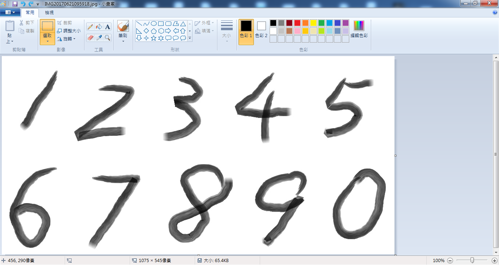

```{r setup, include=FALSE}
knitr::opts_chunk$set(echo = TRUE)
library(knitr)
library(keras)
library(ggplot2)
library(gridExtra)

load(file.path("data", "digit_recognizer", "keras3.RData"))

model = load_model_hdf5(file.path("data", "digit_recognizer", "kerasCNN"))
```

* ### convolutional neural networks (CNN) on the MNIST dataset 

***

    library(keras)
    library(ggplot2)
    library(gridExtra)
    
***

深度學習中對圖像的識別能力，卷積神經網路(Convolutional Neural Networks, CNN)的表現可以說非常突出，以下連結有介紹<a href="https://brohrer.mcknote.com/zh-Hant/how_machine_learning_works/how_convolutional_neural_networks_work.html" target="_blank">CNN的運作原理</a>，這篇以Keras實作CNN為主。Keras 對R使用者有 rstudio 的 <a href="https://rstudio.github.io/keras/index.html" target="_blank">keras</a> 和 CRAN 的 <a href="https://cran.r-project.org/web/packages/kerasR/index.html" target="_blank">kerasR</a> 介面可使用，我將利用前者練習實作，安裝步驟可參考連結。此外，由於Keras底層是TensorFlow ，下載安裝 <a href="https://www.python.org/downloads/release/python-353/" target="_blank">Python 3.5</a> 是必要的，一切備妥後就可以開始使用R的keras套件，這次練習繼續使用 <a href="https://www.kaggle.com/c/digit-recognizer" target="_blank">MNIST 資料集</a> ，以下是這次練習的CNN網路架構...


***

* #### __Load and convert __

首先，載入42000筆訓練資料。其中80%(33600筆)拿來訓練，剩下的8400筆當做測試用

```{r, eval=FALSE}
train_data <- read.csv(file.path("data", "digit_recognizer","train.csv"), stringsAsFactors = F)
set.seed(777)
index <- sample(nrow(train_data), 0.8 * nrow(train_data))
train_dt <- train_data[index, ]
test_dt <- train_data[-index, ]
# train data
train_x <- train_dt[,-1]
train_y <-train_dt[,1]
# test data
test_x <- test_dt[,-1]
test_y <-test_dt[,1]
```

原始資料為灰階影像(28x28 pixels)，keras要求input資料需轉換為3維陣列，轉換後維度由原本的784變成28, 28, 1

```{r}
# 轉成array
train_x <- array(as.matrix(train_x), dim = c(nrow(train_x), 28, 28, 1))
test_x <- array(as.matrix(test_x), dim = c(nrow(test_x), 28, 28, 1))
# normalizing
train_x <- train_x / 255
test_x <- test_x / 255
dim(train_x)
dim(test_x)
```

此外，本次練習目的為分類(標籤0~9)，配合keras需要將多類向量值轉成2進制矩陣，以測試資料前6筆為例，其中直欄[,1]表示0、[,2]表示1 ... [,10]表示9

```{r}
# 標籤為多類向量,需轉換成2進制矩陣
train_y <- to_categorical(array(train_y), 10)
test_y <- to_categorical(array(test_y), 10)
head(test_y)
```

***

* #### __Define and configure __

設定輸入圖像的大小(input_shape)，梯度修正時處理的訓練樣本數(batch_size)，10個標籤值(num_classes)，迭代次數(epochs)

```{r, eval=FALSE}
# 設定參數
input_shape <- c(28, 28, 1)
batch_size <- 128
num_classes <- 10
epochs <- 50
```

本次model定義如下，共卷積4次來擷取特徵，filter sizes訂為3x3，feature maps個數自訂32、64、128、64，採線性整流單元(relu)激活函數避免極端值，簡化維度的池化使用2次，size為2x2，3層全連接的hidden layers...

```{r, eval=FALSE}
# 定義 model
model <- keras_model_sequential()
model %>%
  layer_conv_2d(filters = 32, kernel_size = c(3,3), activation = 'relu',
                input_shape = input_shape) %>% 
  layer_conv_2d(filters = 64, kernel_size = c(3,3), activation = 'relu') %>% 
  layer_max_pooling_2d(pool_size = c(2, 2)) %>% 
  layer_conv_2d(filters = 128, kernel_size = c(3,3), activation = 'relu') %>% 
  layer_conv_2d(filters = 64, kernel_size = c(3,3), activation = 'relu') %>% 
  layer_max_pooling_2d(pool_size = c(2, 2)) %>% 
  layer_dropout(rate = 0.25) %>% 
  layer_flatten() %>% 
  layer_dense(units = 256, activation = 'relu') %>% 
  layer_dropout(rate = 0.5) %>% 
  layer_dense(units = 256, activation = 'relu') %>% 
  layer_dropout(rate = 0.3) %>% 
  layer_dense(units = 128, activation = 'relu') %>% 
  layer_dropout(rate = 0.3) %>% 
  layer_dense(units = num_classes, activation = 'softmax')
```

配置訓練模型的目標函數、優化器及指標

```{r, eval=FALSE}
# 配置
model %>% compile(
  loss = 'categorical_crossentropy',
  optimizer = optimizer_adagrad(),
  metrics = c('accuracy')
)
```

***

* #### __Train a Keras model __

根據上述設定參數開始訓練CNN模型(使用CPU執行,i3 4核執行約150分鐘)...model迭代結果指定至kerasCNN 

```{r, eval=FALSE}
# 訓練model
kerasCNN <- model %>% fit(
  train_x,
  train_y,
  batch_size = batch_size,
  epochs = epochs,
  verbose = 1,
  validation_data = list(test_x, test_y)
)
```

***

* #### __Evaluate and predict __

迭代50次得到的 accuracy 和 loss 如下

```{r, eval=FALSE}
# 效能評估
scores <- model %>% evaluate(
  test_x, test_y, verbose = 0
)
cat('Test accuracy:', scores[[2]], '\n')
cat('Test loss:', scores[[1]], '\n')
```

```{r, echo=FALSE}
cat('Test accuracy:', scores[[2]], '\n')
cat('Test loss:', scores[[1]], '\n')
```

繪出迭代結果(kerasCNN)，本次實驗訓練與測試間預測誤差最小，在 accuracy 和 loss 都出現在第13次，表示此時model預測吻合度佳

```{r, echo=FALSE}
# Plot
grid.arrange(p1, p2, nrow = 2)
```

第13次迭代測試的accuracy 和 loss

```{r, echo=FALSE}
# 預測誤差最小的迭代
subset(history.df, subset = (epoch==minIndex_acc & metric %in% c('val_acc','acc')))
subset(history.df, subset = (epoch==minIndex_loss & metric %in% c('val_loss','loss')))
```

accuracy最大出現在第31次迭代，loss最小則在第24次

```{r, echo=FALSE}
#max acc
subset(history.df, subset = (metric=='val_acc'))[which.max(subset(history.df, subset = (metric=='val_acc'))[,2]),]
#min loss
subset(history.df, subset = (metric=='val_loss'))[which.min(subset(history.df, subset = (metric=='val_loss'))[,2]),]

```

本次CNN架構參數

```{r, echo=FALSE}
summary(model_from_yaml(cnn_model))
```

實際測試，使用小畫家手寫數字再裁剪成10個圖檔...



***

繪出8個隨選圖檔，然後再以model預測驗證...Good, 結果一致

```{r}
#實際測試,隨選8個數字
img_num <- 8
testing <- sample(0:9, img_num)
img_mtx <- matrix(0,img_num, 784)

par(mar=c(2,0,2,0))
layout(matrix(1:(img_num * 1), 1, byrow = T))
for(i in seq_along(testing)){
  PIL = image_load(
    file.path("data", "digit_recognizer", paste0(testing[i], '.jpg')),
    grayscale = T,
    target_size = c(28, 28)
  )
  img_array = 255 - image_to_array(PIL, data_format = 'channels_last')
  img_array = t(img_array[1:28, , 1])
  #plot
  showDigit(img_array, "o")
  img_mtx[i,] <- as.vector(img_array)
}
# 轉成array
img_mtx <- array(img_mtx, dim = c(nrow(img_mtx), 28, 28, 1))
img_mtx <- img_mtx / 255
# 預測
(pclasses <- model %>% predict_classes(img_mtx, batch_size = batch_size))
```


***

* #### __Summary __

這次練習使用Keras實作CNN，同樣使用MNIST資料集，在分類準確性上可以輕鬆達到99%以上，比起<a href="digitRecognizer.html">上次使用DNN</a>來的好，不過由於多了convolutional layers，運算時間也較長。在<a href="https://www.kaggle.com/c/digit-recognizer/leaderboard" target="_blank">kaggle的排行榜</a>上，目前若要進到100名以內的話，起碼要大於99.77%以上，我想除了調整架構、參數優化以外，結合Ensemble或許是個不錯的方法。除了CNN，Keras還有支援RNN、LSTM...這部份後續再花時間研究了

***

* ### Lessons Learned:
    + #### Convolutional Neural Networks (CNN)
    + #### Keras
