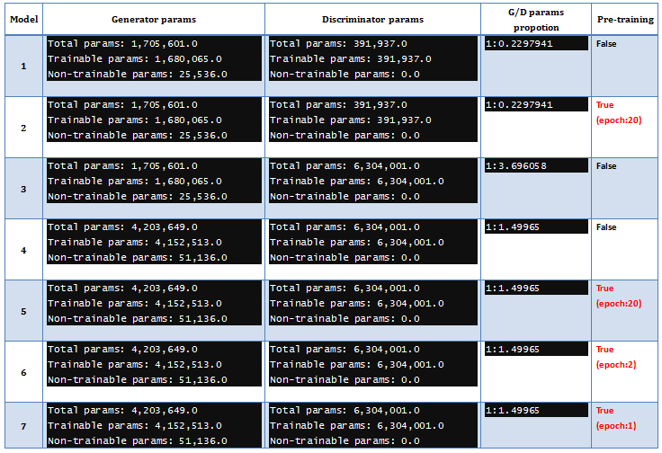
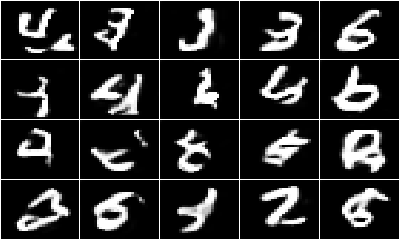

```{r setup, include=FALSE}
knitr::opts_chunk$set(echo = TRUE)
library(knitr)
library(keras)
library(png)
library(plyr)
library(abind)
library(tidyr)
library(ggplot2)
library(gridExtra)
library(dplyr)

load(file.path("data", "identify_the_digit", "mysummary.RData"))

```

* ### generative adversarial networks (GAN) on the MNIST dataset 

***

    library(keras)
    library(png)
    library(plyr)
    library(abind)
    library(tidyr)
    library(ggplot2)
    library(gridExtra)
    library(dplyr)
    
***

以下練習將利用 Keras 搭配 MNIST 資料、實作生成對抗網路(GAN)，在人工智慧(Artificial Intelligence)中這是一個很受關注的領域。簡易的GAN主要包含2種神經網路，生成器(generator)、鑑別器(discriminator)，前者作用在於生成資料、後者作用在於資料的辨別把關，兩者合併組成 GAN Model。以下是這次實驗各 model 說明：

  + 【Model 1】：實作GAN Model，透過訓練學習、自動生成以假亂真的手寫數字
  + 【Model 2】：Model 1 with pre-training discriminator
  + 【Model 3】：增加 discriminator 參數對 GAN 的影響
  + 【Model 4】：增加 generator 參數對 GAN 的影響
  + 【Model 5】：pre-training (20 epochs) discriminator 的 GAN 表現
  + 【Model 6】：pre-training (2 epochs) discriminator 的 GAN 表現
  + 【Model 7】：pre-training (1 epoch) discriminator 的 GAN 表現

實驗 models 參數如下表：



***

* #### __Generative Model __

以 Model 1 為例，這次 generator 的網路架構如下，其任務是利用隨機產生的100個雜訊來生成影像。主要是利用 CNN 的 up-sampling 方式來完成


```{r, eval=FALSE}
# 設定參數
input_shape <- c(28, 28, 1)
batch_size <- 128
epochs <- 200

depth <- 256
noise_size <- 100
momentum <- 0.9

# generator
model_g <- keras_model_sequential()
model_g %>%
  #7,7,256
  layer_dense(units = 7 * 7 * depth, input_shape = noise_size , activation = 'relu') %>%
  layer_batch_normalization(momentum = momentum) %>%
  layer_reshape(c(7, 7, depth)) %>%
  layer_dropout(rate = 0.3) %>%
  #14,14,128
  layer_upsampling_2d(size = c(2, 2)) %>%
  layer_conv_2d(filters = depth / 2, kernel_size = c(3,3),
                activation = 'relu', padding = 'same') %>%
  layer_batch_normalization(momentum = momentum) %>%
  #28,28,64
  layer_upsampling_2d(size = c(2, 2)) %>%
  layer_conv_2d(filters = depth / 4, kernel_size = c(3,3),
                activation = 'relu', padding = 'same') %>%
  layer_batch_normalization(momentum = momentum) %>%
  #28,28,32
  layer_conv_2d(filters = depth / 8, kernel_size = c(3,3),
                activation = 'relu', padding = 'same') %>%
  layer_batch_normalization(momentum = momentum) %>%
  #28,28,1
  layer_conv_2d(filters = 1, kernel_size = c(3,3), padding = 'same',
                activation = 'sigmoid')

# configure the generator
model_g %>% compile(
  loss = 'binary_crossentropy',
  optimizer = optimizer_adam(lr = 0.00025, beta_1 = 0.8)
)

```

***

* #### __Discriminative Model __

Model 1 的 discriminator 的網路架構如下，它的任務是辨別輸入的影像是真實或假的，主要是利用 strides 參數來達成 down-sampling 的作用


```{r, eval=FALSE}
# discriminator
model_d <- keras_model_sequential()
model_d %>%
  #28,28,1 -> 14,14,32
  layer_conv_2d(filters = 32, kernel_size = c(3,3), padding = "same",
                strides = c(2,2), input_shape = input_shape) %>%
  layer_activation_leaky_relu(alpha = 0.2) %>%
  layer_dropout(rate = 0.3) %>%
  #14,14,64
  layer_conv_2d(filters = 64, kernel_size = c(3,3), padding = "same",
                strides = c(1,1)) %>%
  layer_activation_leaky_relu(alpha = 0.2) %>%
  layer_dropout(rate = 0.3) %>%
  #7,7,128
  layer_conv_2d(filters = 128, kernel_size = c(3,3), padding = "same",
                strides = c(2,2)) %>%
  layer_activation_leaky_relu(alpha = 0.2) %>%
  layer_dropout(rate = 0.3) %>%
  #4,4,256
  layer_conv_2d(filters = 256, kernel_size = c(3,3), padding = "same",
                strides = c(2,2)) %>%
  layer_activation_leaky_relu(alpha = 0.2) %>%
  layer_dropout(rate = 0.3) %>%
  #4096
  layer_flatten() %>%
  #1
  layer_dense(units = 1, activation = "sigmoid")

# configure the discriminator
model_d %>% compile(
  loss = 'binary_crossentropy',
  optimizer = optimizer_adam(lr = 0.0005, beta_1 = 0.8),
  metrics = c('accuracy')
)

```

***

* #### __GAN Model __

有了 generator 和 discriminator，接下來將兩者合併組成 GAN Model，其運行流程如下，利用 generator 來生成假的影像，discriminator 負責辨別影像的真偽。GAN Model 有兩個特性要強調：models 再利用與凍結權重。再利用是指 callable 的特性，GAN Model re-using generator 和 discriminator models 及其權重，也就是下面程式碼 model_comb re-using model_g 和 model_d。凍結 GAN Model 中 discriminator (model_d) 的權重，亦即只訓練 GAN 裡的 generator (model_g)


```{r, eval=FALSE}
# combine / Adversarial Model
gan_input  <- layer_input(shape = noise_size)
fake <- model_g(list(gan_input))

# 凍結權重
model_d$trainable <- FALSE
results <- model_d(fake)

model_comb <- keras_model(list(gan_input), results)

model_comb %>% compile(
  loss = 'binary_crossentropy',
  optimizer = optimizer_adam(lr = 0.00025, beta_1 = 0.8)
)

```

***

* #### __Load Images __

雖然繼續使用MNIST資料，這次練習從<a href="https://datahack.analyticsvidhya.com/contest/practice-problem-identify-the-digits/" target="_blank">Analytics Vidhya</a>下載PNG圖檔，共49000筆

```{r, eval=FALSE}
# 準備資料
train <- read.csv(file.path('data/identify_the_digit/Train_HI6auGp/Train','train.csv'), stringsAsFactors = F)
# read PNG
readIMG <- function(filename_v, folder = 'train') {
  img_path <- 'data/identify_the_digit/Train_HI6auGp/Train/Images'
  img_folder <- folder
  train_img <- ldply(filename_v, function(filename) {
    img <- readPNG(file.path(img_path, img_folder, filename))
    h <- 28
    w <- 28
    mtx <- matrix(t(img[,,1]), 1, h*w)
    return(mtx)
  })
  return(train_img)
}

# 讀入image成784個features
train_data <- readIMG(train[,1])
# add label
train_data <- cbind(label = train[,2], train_data)

set.seed(777)
# 訓練/測試比 8:2
index <- sample(nrow(train_data), 0.8 * nrow(train_data))
train_dt <- train_data[index, ]
test_dt <- train_data[-sort(index), ]
# train data
train_x <- train_dt[,-1]
train_y <-train_dt[,1]
# test data
test_x <- test_dt[,-1]
test_y <-test_dt[,1]
# range 介於0和1，對應 model 中的 activation = 'sigmoid'
range(train_x)
range(test_x)
# 轉成array
train_x <- array(as.matrix(train_x), dim = c(nrow(train_x), 28, 28, 1))
test_x <- array(as.matrix(test_x), dim = c(nrow(test_x), 28, 28, 1))
# 資料筆數
num_train <- dim(train_x)[1]
num_test <- dim(test_x)[1]

```

***

* #### __Train GAN Models __

200 epochs 訓練，每次 epoch 再進行分批訓練

```{r, eval=FALSE}
# 開始訓練:200 epochs

# performance for each epoch
performance <- data.frame()

for(epoch in 1:epochs){
  (t1 = Sys.time())
  epoch_loss_df <- NULL
  
  # max rows_batch
  rows_batch <- ceiling(num_train / batch_size)
  # batch-sample matrix
  mx_bt_train <- suppressWarnings(matrix(sample(seq_len(num_train)),
                                         rows_batch, batch_size, byrow = T))
  # run batch
  epoch_loss_df = ldply(1:rows_batch, function(bt, mx_bt_train) {
    batch = sort(mx_bt_train[bt,])
    
    # generate a new batch of noise
    noise <- runif(n = batch_size * noise_size, min = -1, max = 1) %>%
      matrix(nrow = batch_size, ncol = noise_size)
    # 產生 fake images
    generated_images <- predict(model_g, noise)
    # real images, (drop = F) return 資料框架
    image_batch <- train_x[batch,,,,drop = FALSE]

    X <- abind(image_batch, generated_images, along = 1)
    # 1L for real, 0L for fake
    Y <- c(rep(1L, batch_size), rep(0L, batch_size)) %>% matrix(ncol = 1)
    # batch訓練 model_d
    disc_loss <- train_on_batch(model_d, X, Y) %>% unlist()
    
    # 產生2倍(128 * 2)noise
    noise <- runif(n = batch_size * noise_size * 2, min = -1, max = 1) %>%
      matrix(nrow = batch_size * 2, ncol = noise_size)
    trick <- rep(1, 2 * batch_size) %>% matrix(ncol = 1)
    # batch訓練 model_comb
    comb_loss <- train_on_batch(model_comb, noise, trick) %>% unlist()
    
    return(c(disc_ep_loss_1 = disc_loss[1],  disc_ep_loss_2 = disc_loss[2],
             comb_ep_loss_1 = comb_loss[1], comb_ep_loss_2 = comb_loss[2]))
  }, mx_bt_train)
  
  cat(sprintf("\nTesting for epoch %02d:", epoch))
  
  # evaluate test loss ---
  # 產生num_test的 noise
  noise <- runif(num_test * noise_size, min = -1, max = 1) %>%
    matrix(nrow = num_test, ncol = noise_size)
  # 產生 fake images
  generated_images <- predict(model_g, noise)

  # evaluate model_d 能否辨別
  X <- abind(test_x, generated_images, along = 1)
  Y <- c(rep(1L, num_test), rep(0L, num_test)) %>% matrix(ncol = 1)
  disc_test_loss <- evaluate(model_d, X, Y, verbose = 0) %>% unlist()
  
  # 欄平均
  epoch_disc_loss <- subset(epoch_loss_df, select = c(disc_ep_loss_1, disc_ep_loss_2))
  disc_train_loss <- apply(epoch_disc_loss, 2, mean)
  
  # 產生num_test 2倍noise
  noise <- runif(2 * num_test * noise_size, min = -1, max = 1) %>%
    matrix(nrow = 2 * num_test, ncol = noise_size)
  trick <- rep(1, 2 * num_test) %>% matrix(ncol = 1)
  comb_test_loss <- evaluate(model_comb, noise, trick, verbose = 0) %>% unlist()
  
  epoch_comb_loss <- subset(epoch_loss_df, select = c(comb_ep_loss_1, comb_ep_loss_2))
  comb_train_loss <- apply(epoch_comb_loss, 2, mean)
  
  # generate an epoch report on performance
  row_fmt <- "\n%25s : loss %4.2f | identify %5.2f"
  cat(sprintf(row_fmt, "Adversarial Model (train)", comb_train_loss[1],comb_train_loss[2]))
  cat(sprintf(row_fmt, "Adversarial Model (test)", comb_test_loss[1], comb_test_loss[2]))
  
  cat(sprintf(row_fmt, "Discriminate (train)", disc_train_loss[1], disc_train_loss[2]))
  cat(sprintf(row_fmt, "Discriminate (test)", disc_test_loss[1], disc_test_loss[2]))
  
  cat("\n")
  
  # rbind performance
  performance <- rbind(performance,
                       data.frame(epoch = epoch, comb_train_loss = comb_train_loss[1],
                                  comb_train_identify = comb_train_loss[2], comb_test_loss = comb_test_loss[1],
                                  comb_test_identify = comb_test_loss[2], disc_train_loss = disc_train_loss[1],
                                  disc_train_identify = disc_train_loss[2], disc_test_loss = disc_test_loss[1],
                                  disc_test_identify = disc_test_loss[2]))
  
  # generate digits to display
  set.seed(777)
  noise <- runif(20 * noise_size, min = -1, max = 1) %>%
    matrix(nrow = 20, ncol = noise_size)
  generated_images <- predict(model_g, noise)
  
  # plot & save
  png(filename = file.path("image", "PNG",sprintf("epoch_%03d.png", epoch)),
      width = 400, height = 240)
  plotDigit(generated_images)
  dev.off()
  
  print(difftime(Sys.time(), t1, units = 'secs'))
}

```


***

* #### __Pre-training Discriminator __

在組成 GAN Model 前的 Pre-training，以20 epochs為例 

```{r, eval=FALSE}
# 產生雜訊
noise <- runif(n = num_train * noise_size, min = -1, max = 1) %>%
  matrix(nrow = num_train, ncol = noise_size)
# 產生 fake images
generated_images <- predict(model_g, noise)
dim(generated_images)

# 訓練 model_d
X <- abind(train_x, generated_images, along = 1)
Y <- c(rep(1L, num_train), rep(0L, num_train)) %>% matrix(ncol = 1)

(t1 = Sys.time())
history_d <- model_d %>% fit(
  X,
  Y,
  batch_size = batch_size,
  epochs = 20,
  verbose = 1,
  validation_split = 0.2
)
print(difftime(Sys.time(), t1, units = 'mins'))

plot(history_d)

```

***

* #### __Performance __

    + #### 【Model 1】
    
    Generator 總參數 1,705,601，Discriminator 為 391,937，G/D 參數比約 1:0.23，沒有 Pre-training。從個別的 Loss 來看，Discriminator Loss 前幾次都在 0 附近徘徊，持續對抗，隨 epoch 增加，Loss 越來越大、貼近 0.7。相對的，Generator 一開始 Loss 很大，隨epoch 增加，Loss 越來越小，表示在生成過程找到學習方法
    
    
    
    將兩者 Loss 圖繪在一起，可以看出 Discriminator Loss 增加時，Generator Loss 相對減少，隨著 epochs 增加、逐步達成生成和對抗的平衡
    
    
    
    從 epochs 過程中來看，大約在第19次 epoch 時，隨機生成的圖比較具體一點，也呼應上圖的 Loss 變化
    
    
    
    在 Discriminator 的辨別能力方面，隨著 epochs 增加、逐漸下降。理想中的值為 0.5，表示 Generator 具有完全以假亂真的生成能力。從下圖來看，測試資料的結果波動明顯，訓練資料結果離 0.5 還有一小段距離
    
    
    
    下圖是第 200 次 epoch 後隨機生成的圖
    
    
    
    ***
    
    + #### 【Model 2】
    
    使用和 Model 1 相同的參數，不過在 GAN 前先 Pre-training Discriminator (20 epochs)，Pre-training 過程如下
    
    
    
    Discriminator 雖然有變強了一點，不過在第20次 epoch 附近也明顯出現 Loss、最後也貼近 0.7
    
    
    
    過了第25次epoch之後，也漸漸達成生成和對抗的平衡
    
    
    
    從 epochs 過程中來看，在第21次 epoch 時，隨機生成的圖比較具體一點，呼應上圖 comb_test_loss 第一次的陡降
    
    
    
    Discriminator 的辨別能力也靠往 0.5，大約落在 0.53左右，測試資料結果波動還是不小，甚至還有低於 0.4的...
    
    
    
    Model 2 第 200 次 epoch 隨機生成的圖
    
    
    
    ***
    
    + #### 【Model 3】
    
    Generator 總參數 1,705,601 維持不變，但大幅增加 Discriminator 參數至 6,304,001，G/D 參數比約 1:3.7，沒有 Pre-training。從個別的 Loss 來看，與前2個 models 相比，Discriminator 參數變多、相對調幅step變小，comb_test_loss 明顯下降也出現在比較前面的 epoch
    
    
    
    在第10次epoch時已開始收斂、逐步達成生成和對抗的平衡
    
    
    
    在第10次epoch隨機生成圖已經開始有了雛型，相較前2種Model提前不少
    
    
    
    Discriminator 的辨別能力在第200次epoch時約0.53，感覺更多 epochs 還有機會降到更接近0.5
    
    
    
    Model 3 第 200 次 epoch 隨機生成的圖
    
    
    
    ***
    
    + #### 【Model 4】
    
    這次 Generator 總參數由原本的 1,705,601 增加至 4,203,649，Discriminator 參數維持Model 3的 6,304,001，G/D 參數比縮為 1:1.5 左右，沒有 Pre-training。Discriminator 明顯出現 Loss 的現象更提早了，表示 GAN 學習的step更加快
    
    
    
    比Model 3更快收斂、後續生成和對抗的平衡更平順
    
    
    
    在第5次epoch隨機生成圖已經出現雛型，是目前所有 Models 中最快的
    
    
    
    相較於前幾個Models，Discriminator 的辨別能力是最貼近0.5的(在100次 epochs之後)
    
    
    
    Model 4 第 200 次 epoch 隨機生成的圖
    
    
    
    ***
    
    + #### 【Model 5】
    
    使用和 Model 4 相同的參數，不過在 GAN 前先 Pre-training Discriminator (20 epochs)，Pre-training 過程如下
    
    
    
    Discriminator 經過 20 次 Pre-training後，GAN 變的難以訓練，從下圖的comb_train_loss看來，GAN Generator 已經退化無法學習，Loss 一直無法取得進展，這 Model 學習過程已經崩潰(collapse)，無法繼續訓練
    
    
    
    Discriminator 和 GAN Generator 學習過程發生崩潰，無法往極大極小發展出生成和對抗的平衡
    
    
    
    隨機生成一堆相似的雜訊圖
    
    
    
    Discriminator 一直對相似的樣本資料誤判
    
    
    
    Model 5 第 200 次 epoch 隨機生成的圖
    
    
    
    ***
    
    + #### 【Model 6】
    
    有鑒於 Model 5訓練失敗，這次仍使用相同的參數架構，不過縮小Discriminator Pre-training 次數 (2 epochs)。沒想到學習過程還是崩潰(collapse)，無法繼續訓練
    
    
    
    Discriminator 和 GAN Generator 學習過程發生崩潰，還是無法往極大極小發展出生成和對抗的平衡
    
    
    
    從epoch 8之後，還是隨機生成一堆相似的雜訊圖
    
    
    
    Model 崩潰，Discriminator 也是一直對相似的樣本資料誤判
    
    
    
    Model 6 第 200 次 epoch 隨機生成的圖
    
    
    
    ***
    
    + #### 【Model 7】
    
    最後，這次仍使用相同的參數架構，不過縮小Discriminator Pre-training 次數 (1 epochs)。從Loss看來，分別往極大極小發展了，看起來訓練學習還不錯
    
    
    
    大約在第10次epoch時開始收斂，之後的生成和對抗平衡也滿平順的
    
    
    
    大約第9次epoch的隨機生成就有了雛型，收斂學習的情形還不錯
    
    

    
    Discriminator 最後的辨別能力非常接近0.5，而且過程中測試資料結果波動振盪幅度和前面幾次相比相對小，表示 Model 相對穩定
    
    
    
    Model 7 第 200 次 epoch 隨機生成的圖
    
    
    
    Model 7 隨機生成的 Gif 動畫(epochs 200次)
    
    
    

***

* #### __Summary __

透過這次GAN的實作，學習到生成對抗模型的運作，雖然 Generator 和 Discriminator 參數的拿捏和設計沒有絕對，不過從這次實驗結果來看，Discriminator 參數若小於 Generator 很多時，在 Pre-training 設計上似乎比較寬鬆(如 Model 2)，比較不易產生崩潰問題，不過也因為 Discriminator 參數少，測試資料結果波動較大，在相同的 epochs 下，其辨別能力也比較慢達到0.5。而 Discriminator 參數若大於 Generator 很多時，隨機生成圖似乎較容易出現雛型，不過辨別能力一樣比較慢達到0.5，如 Model 3。當 Generator 和 Discriminator 參數增加且參數比例拉近時(如 Model 4)，訓練學習成效似乎比較好，不過在 Pre-training 時也相對敏感，如 Model 5 和 6 出現學習崩潰。

```{r, echo=FALSE}
kable(mysummary)
```


***

* ### Lessons Learned:
    + #### Generative Adversarial Networks (GAN)

