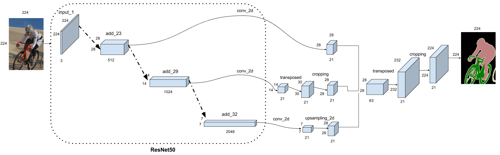
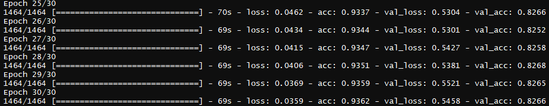
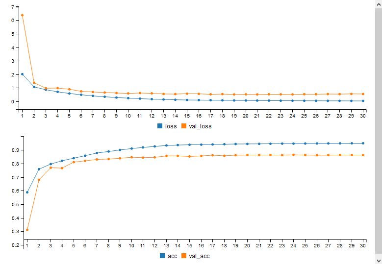
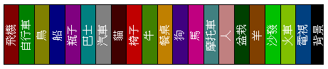

```{r setup, include=FALSE}
knitr::opts_chunk$set(echo = TRUE)
library(keras)
library(plyr)
library(ggplot2)
library(ff)

load(file.path("data", 'voc2012', 'voc2012.RData'))
model <- load_model_hdf5(file.path("data", "voc2012",'ResNet50_model.hdf5'))
```

* ### VOC2012 - Semantic Segmentation using Keras with Tensorflow

***

    library(keras)
    library(plyr)
    library(ggplot2)
    library(ff)
    
***

前面練習的圖像識別(image recognition)使用CNN + fully-connected 的方法，對整張圖像來進行分類。這次練習的語意分割(semantic segmentation)將使用<a href="https://arxiv.org/abs/1605.06211" target="_blank"> FCN </a>(Fully Convolutional Networks)方法，以像素為單位(pixel-wise)來進行分類，分割任務除了要知道像素是屬於哪一類(what)之外，還要偵測它所屬的位置(where)。使用的資料集為<a href="http://host.robots.ox.ac.uk/pascal/VOC/voc2012/#devkit" target="_blank">VOC2012</a>，訓練資料1464筆、測試1449筆，類別包括飛機、自行車、鳥...等20種，目的是希望將輸入的影像進行類別分割(ex:如下圖)，在醫療診斷、自動駕駛...都有類似的應用

***


***

首先，載入訓練和測試資料images，寬、高 resize 為224

```{r, eval=FALSE}
train_info <- read.table('data/voc2012/ImageSets/Segmentation/train.txt', sep = ' ', stringsAsFactors = F)
test_info <- read.table('data/voc2012/ImageSets/Segmentation/val.txt', sep = ' ', stringsAsFactors = F)

# read images
readIMG <- function(filename_v, h , w ) {
  img_arry <- laply(filename_v, function(filename) {
    img <- image_load(filename, target_size = c(h, w))
    return(image_to_array(img))
  })
  return(img_arry)
}

img_height <- 224
img_width <- 224

# 讀入image
train_JPGimage <- readIMG(paste0('data/voc2012/JPEGImages/' ,train_info$V1, '.jpg'), img_height, img_width)
train_PNGclass <- readIMG(paste0('data/voc2012/SegmentationClass/', train_info$V1, '.png'), img_height, img_width)

test_JPGimage <- readIMG(paste0('data/voc2012/JPEGImages/', test_info$V1, '.jpg'), img_height, img_width)
test_PNGclass <- readIMG(paste0('data/voc2012/SegmentationClass/', test_info$V1, '.png'), img_height, img_width)
```

***

原始JPG輸入為彩色圖像(channels = 3)，然而分割類別有20種(飛機、自行車、鳥、船、瓶子、巴士、汽車、貓、椅子、牛、餐桌、狗、馬、摩托車、人、盆栽、羊、沙發、火車、電視)。為了釐清各類代表的顏色，先手動挑選各類照片、透過 rgb 方法萃取相關色碼來參考

```{r, echo=FALSE}
par(mfrow = c(5, 6), mar = rep(0.3, 4), pty='s')
for(i in  1:20){
  plot(c(0, 224), c(0, 224), type = "n", xlab = "", ylab = "", axes = F)
  rasterImage(test_JPGimage[i,,,]/255, 0, 0, 224 , 224)
  plot(c(0, 224), c(0, 224), type = "n", xlab = "", ylab = "", axes = F)
  rasterImage(test_PNGclass[i,,,]/255, 0, 0, 224 , 224)

  colors <- apply(matrix(test_PNGclass[i,,,] , 224^2, 3) /255, 1, extractColors)
  pie(prop.table(table(colors)), col = names(prop.table(table(colors))), labels = names(prop.table(table(colors))))
}
```

從class segmentation的圖像中，可以歸納出 21 種表示類別的色碼(背景#000000、物體邊線#E0E0C0我歸納為第21種，以#000000表示)

```{r, eval=FALSE}
rgbCol <- c('#800000','#008000','#808000','#000080','#800080','#008080','#808080','#400000','#C00000','#408000',
            '#C08000','#400080','#C00080','#408080','#C08080','#004000','#804000','#00C000','#80C000','#004080', '#000000')
clsIndex <- 1:21

clsObject <- c('飛機', '自行車', '鳥', '船', '瓶子', '巴士', '汽車', '貓', '椅子', '牛', '餐桌', '狗',
               '馬', '摩托車', '人', '盆栽', '羊', '沙發', '火車', '電視', '背景')
```

接著利用以下函式，將PNG圖像轉為channels = 21 的 binary 陣列。由於硬體限制(記憶體32G)，我利用ff套件先存、再讀入轉成array(224, 224, 21)，到這裡完成了資料的準備

```{r, eval=FALSE}
# RGB color to class index
extractCol2cls <- function(x){
  x <- x /255
  rgb_col <- rgb(x[,1], x[,2], x[,3])
  rgb_cls <- match(rgb_col, rgbCol)
  return(rgb_cls)
}

# RGB color 轉 pixel index by each class
RGB2classArray <- function(png_array, ff_arry) {
  p_info <- dim(png_array)
  p_num <- p_info[1]
  p_height <- p_info[2]
  p_width <- p_info[3]

  for (i in seq_len(p_num)) {
    print(i)
    p_cls <- extractCol2cls(matrix(png_array[i, , , ] , p_height * p_width, 3))
    # get appear unique index
    uni_index <- unique(p_cls)
    for (x in seq_along(uni_index)) {
      ff_arry[i , which(p_cls == uni_index[x]), uni_index[x]] <- 1
    }
  }
}

# save
ff_train <- ff(initdata = 0, dim = c(1464, 50176, 21), vmode = "quad", filename = 'data/voc2012/ff_train.ff')
ff_test <- ff(initdata = 0, dim = c(1449, 50176, 21), vmode = "quad", filename = 'data/voc2012/ff_test.ff')
RGB2classArray(train_PNGclass, ff_train)
RGB2classArray(test_PNGclass, ff_test)
close(ff_train)
close(ff_test)
ffsave(ff_train, file = 'data/voc2012/ff_train')
ffsave(ff_test, file = 'data/voc2012/ff_test')

# ff to array
aa_train <- array(data = ff_train[,,], dim = c(1464, 224, 224, 21))
aa_test <- array(data = ff_test[,,], dim = c(1449, 224, 224, 21))
```

***

Keras 套件目前提供6種 pre-trained models(包括Inception V3、MobileNet、ResNet50、VGG16、VGG19 和 Xception V1)，ResNet50 在深度處理和表現上很卓越，我用它當 base model 來 extract features，結合custom layers的卷積投射及上採樣來實現語義分割，本次 model 架構如下。這裡我選定三處的outputs 進行 splite，它們的 layers names 分別是 add_23、add_29 及 add_32




載入 ResNet50 為base model 並查看 layers names 和 shape size。這裡我並未凍結(freeze)卷積層的權重來進行transfer learning，原因是在這次實驗中使用的成效沒有比較好

```{r, eval=FALSE}
class_size <- 21
batch_size <- 32
epochs <- 30
kernel_size <- c(3, 3)
momentum <- 0.99

inputs <- layer_input(shape =  c(img_height, img_width, 3))

base_model <- application_resnet50(weights = 'imagenet', include_top = FALSE, input_tensor = inputs)

# show layers names, shape size
bm_layers <- base_model$layers
for (i in 1:length(bm_layers))
  cat(i, bm_layers[[i]]$name, unlist(bm_layers[[i]]$output_shape), "\n")
```

從上可得知 add_23、add_29 及 add_32 的位置分別為78、140及172。透過卷積、上採樣並修剪為統一的大小(28*28,21)，方便後續合併。在140 和 172使用不同的上採樣方法，keras 中 conv_2d_transpose 為轉置卷積，透過反向卷積進行轉換，而 upsampling_2d 是重複 rows 和 columns 來放大資料，換言之，容易受放大倍數影響(失真、粗糙...)，不過較底層layer萃取的特徵較具體，加上size相對小，所以在172位置後我採用upsampling_2d

```{r, eval=FALSE}
outputs78 <- base_model$layers[[78]]$output %>%
  #28, 28, 512
  layer_conv_2d(filters = class_size, kernel_size = c(1, 1), padding = "same", activation = 'relu', name = 'cp_1') %>%
  #28, 28, 21
  layer_batch_normalization(momentum = momentum)


outputs140 <- base_model$layers[[140]]$output %>%
  #14, 14, 1024
  layer_conv_2d(filters = class_size, kernel_size = c(1, 1), padding = "same", activation = 'relu', name = 'cp_2') %>%
  #14, 14, 21
  layer_conv_2d_transpose(filters = class_size, kernel_size = c(4, 4), strides = c(2, 2), activation = 'relu',
                          use_bias = FALSE, name = 'cp_21') %>%
  #30, 30, 21
  layer_cropping_2d(cropping = list(c(1, 1), c(1, 1)), name = 'cp_22') %>%
  #28, 28, 21
  layer_batch_normalization(momentum = momentum)


outputs172 <- base_model$layers[[172]]$output %>%
  #7, 7, 2048
  layer_conv_2d(filters = class_size, kernel_size = c(1, 1), padding = "same", activation = 'relu', name = 'cp_3') %>%
  #7, 7, 21
  layer_upsampling_2d(size = c(4, 4)) %>%
  #28, 28, 21
  layer_batch_normalization(momentum = momentum)
```

合併，將上述三個tensors加總再進行最後一次的反向卷積與修剪，最後吐出和INPUT原圖同大小的結果，到這裡完成 model 的建置。優化器採用 adadelta ，decay 自訂 0.0001

```{r, eval=FALSE}
# merged
outputsMerged <- layer_concatenate(inputs = list(outputs78, outputs140, outputs172)) %>%
  #28, 28, 63
  layer_conv_2d_transpose(filters = class_size, kernel_size = c(16, 16), strides = c(8, 8), activation = 'relu',
                          use_bias = FALSE, name = 'm_1') %>%
  #232, 232, 21
  layer_cropping_2d(cropping = list(c(4, 4), c(4, 4))) %>%
  #224, 224, 21
  layer_activation(activation = 'softmax', name = 'm_final')

model <- keras_model(inputs = base_model$input, outputs = outputsMerged)

# Configure
model %>% compile(
  loss = "categorical_crossentropy",
  optimizer = optimizer_adadelta(decay = 0.0001),
  metrics = "accuracy"
)
```

***

INPUT 的JPG 進行 imagenet_preprocess_input 處理...開始訓練!!!

```{r, eval=FALSE}
# train
model %>% fit(
  imagenet_preprocess_input(train_JPGimage), aa_train,
  batch_size = batch_size,
  epochs = epochs,
  validation_data = list(imagenet_preprocess_input(test_JPGimage), aa_test),
  shuffle = TRUE
)
```


訓練過程的log(以最後5筆為例)...最後測試的loss是0.5458、accuracy是0.8266




30次epochs的訓練歷程表現



***

來看看之前的20筆測試資料預測的結果(如下圖)...整體來說，單一類別且物體線條簡單的圖橡在分割表現上都不錯，例如飛機、鳥、汽車、牛、羊...等。不過，自行車就誤判成摩托車、餐桌上的瓶子也沒識別出來、相鄰的貓狗也有部份誤判、重疊桌椅分割結果也不是很理想、騎馬的人也是...




```{r, echo=FALSE}
# class to rgb
decodeRGB <- function(pd) {
  pa <- array(data = pd, dim = c(50176, 21))
  prgb <- rgbCol[apply(pa ,1 , which.max)]
  return(matrix(prgb, 224, 224))
}
# plot test prediction
  predict_PNGclass <- predict(model, imagenet_preprocess_input(test_JPGimage[1:20,,,]))

  par(mfrow = c(5, 6), mar = rep(0.3, 4), mai = rep(0.1, 4))
  for(p in 1:20){
    plot(c(0, 224), c(0, 224), type = "n", xlab = "", ylab = "", axes = F, main = 'image')
    rasterImage(test_JPGimage[p,,,] / 255, 0, 0, 224, 224)
    plot(c(0, 224), c(0, 224), type = "n", xlab = "", ylab = "", axes = F, main = 'class segmentation')
    rasterImage(test_PNGclass[p,,,]/255, 0, 0, 224 , 224)
    plot(c(0, 224), c(0, 224), type = "n", xlab = "", ylab = "", axes = F, main = 'prediction')
    rasterImage(decodeRGB(predict_PNGclass[p,,,]), 0, 0, 224, 224)
  }
```

最後，以個人實際幾張照片再測試看看...結果大致同上，雖然分割的不是很完美，但類別和位置上表現都算差強人意

```{r, echo=FALSE}
king <- 1:8
king_JPGimage <- readIMG(paste0('image/test/k' ,king, '.jpg'), img_height, img_width)
king_PNGclass <- predict(model, imagenet_preprocess_input(king_JPGimage))

par(mfrow = c(2, 2), mar = rep(0.15, 4), mai = rep(0.25, 4))
for(p in seq_along(king)){
  plot(c(0, 224), c(0, 265), type = "n", xlab = "", ylab = "", axes = F, main = 'image')
  rasterImage(king_JPGimage[p,,,] / 255, 0, 0, 224, 224)
  plot(c(0, 224), c(0, 265), type = "n", xlab = "", ylab = "", axes = F, main = 'prediction')
  rasterImage(decodeRGB(king_PNGclass[p,,,]), 0, 0, 234, 224)
  rect(11.2*(clsIndex-1), 224, 11.2*clsIndex, 265, col = rgbCol)
  text(11.2*clsIndex-8, 255, clsObject, cex = .7, pos=1, srt = 90, col = 'white')
}
```

***

* #### __Summary __

這次透過Keras內建的ResNet50為base model，加上custom layers、實現FCN於語義分割，30次 epochs 結果的 accuracy 是 0.8266、loss是0.5458。這樣的結果還有很多進步的空間，例如調整參數權重、使用資料擴增等等，這次過程中的訓練和測試資料都存在記憶體中，雖然筆數加總才近3000筆，不過channels 由3變成21也著實膨脹不少，感覺有點吃不消。另外，這次使用的Keras版本是2.0.6，我一直在思考如何使用flow_images_from_directory於這樣的分割任務上，因為若是不支援，那麼回到flow_images_from_data的方法上，勢必又得面臨內存的問題。對了，以上訓練是使用GPU 1080，CPU 7700，記憶體32G，OS為win 10.

***

* ### Lessons Learned:
    + #### Semantic Segmentation / Class Segmentation
    + #### Transposed Convolution / Deconvolution
    + #### Transfer Learning


