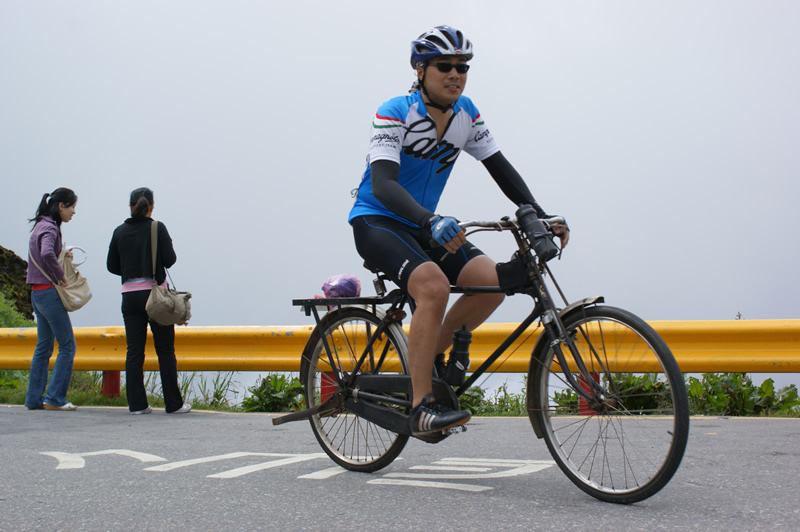
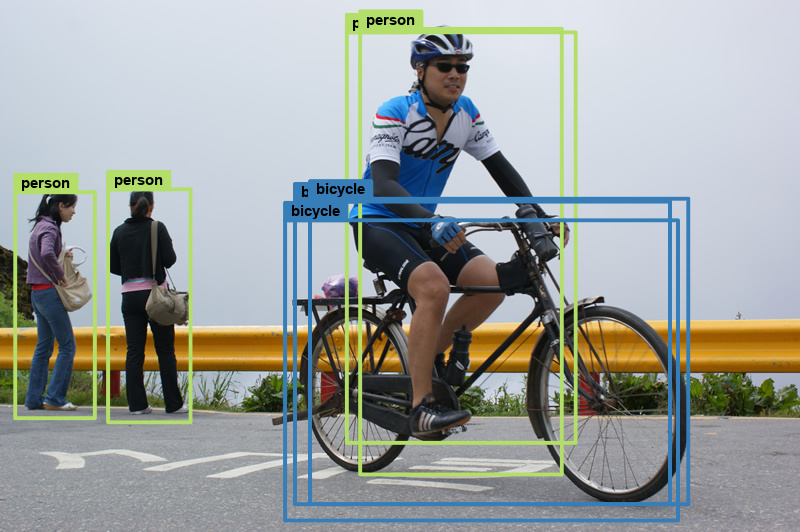
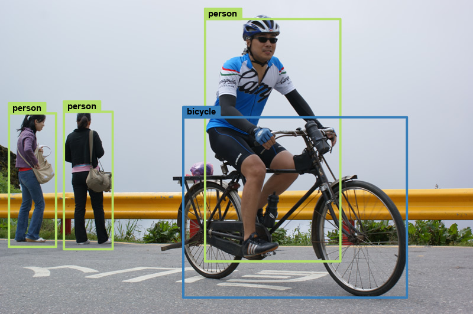
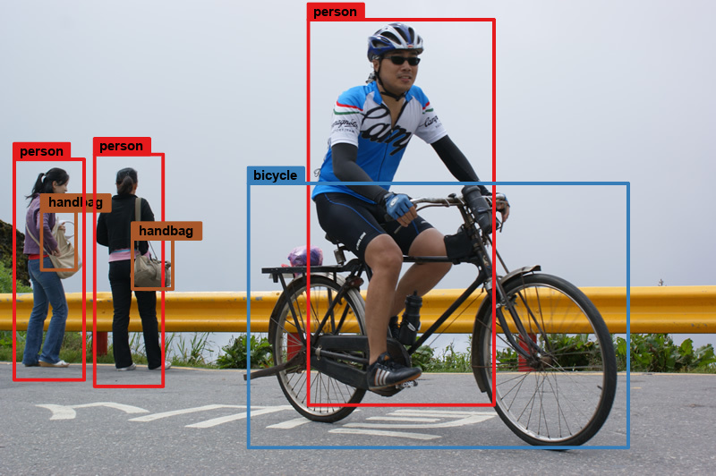

```{r setup, include=FALSE}
knitr::opts_chunk$set(echo = TRUE)
library(tensorflow)
library(keras)
library(magick)
library(reticulate)
library(RColorBrewer)
library(imager)
```

* ### Implement a pre-trained YOLOv2 model - object detection

***

    library(tensorflow)
    library(keras)
    library(magick)
    library(reticulate)
    library(RColorBrewer)
    library(imager)
    
***

物體偵測(object detection)的手法大致可分為兩種，one-stage 和 two stage，前者如SSD 和 YOLO，後者如Faster R-CNN 和R-FCN ，前者檢測精確度高、後者檢測速度快，各有優缺。<a href='https://pjreddie.com/darknet/yolo/' target="_blank">YOLO</a>目前最新版本為v3，本篇實作pre-trained YOLOv2 model，檢測labels分為20類和80類(使用VOC和COCO資料)，<a href='https://www.datasciencecentral.com/profiles/blogs/autonomous-driving-car-detection-with-yolo-model-with-keras-in' target="_blank">相關YOLO原理</a>網路上很多介紹，建議先花點時間理解，本篇以實作為主

***

首先，定義使用参數的名稱。IMAGE_H(W)是載入model影像的高(寬)、GRID_H(W)是等分網格的數目，CLASS類別是LABELS長度，ANCHORS是預設的錨框，LABELS為類別名稱，H5_PATH為h5權重檔案所在的路徑，YOLOv2預設使用5個BOX偵測物體，OBJ_THRESHOLD為物體偵測的門檻值，CLS_THRESHOLD為出現某一類別的門檻值，NMS_THRESHOLD為避免同一物體出現多個偵測方框所使用的門檻值，isCOCO為是否使用COCO資料權重，LABELS_color定義類別方框顏色，這裡使用 RColorBrewer 套件中 Set1 和 Set3的20種顏色，重覆4次

```{r, echo=TRUE}
#cfg參數
IMAGE_H <- NA
IMAGE_W <- NA
GRID_H <- NA
GRID_W <- NA
CLASS <- NA
ANCHORS <-  NA
LABELS <- NA
H5_PATH <- NA
BOX <- 5
#設定threshold
OBJ_THRESHOLD <- 0.5
CLS_THRESHOLD  <- 0.30
NMS_THRESHOLD  <- 0.55

isCOCO <- FALSE
LABELS_color <- c(rep(c(brewer.pal(8, "Set1"), brewer.pal(12, "Set3")), 4))
```

***

設定參數。YOLOv2在應用在COCO資料集載入的圖像長寬為608，在VOC則是416，都是32的倍數，相除所得的網格數目分別是19和13，定義的錨框(ANCHORS)也不相同，這些cfg 和 weights都可以從<a href='https://pjreddie.com/darknet/yolo/' target="_blank">YOLO網站</a>下載

```{r, echo=TRUE}
#設定參數
set_cfg <- function(isCOCO = TRUE) {
  
  if(isCOCO){ # for COCO
    IMAGE_H <<- 608
    IMAGE_W <<- 608
    GRID_H <<- 19
    GRID_W <<- 19
    ANCHORS <<- c(0.57273, 0.677385, 1.87446, 2.06253, 3.33843, 5.47434, 7.88282, 3.52778, 9.77052, 9.16828)
    
    LABELS <<- c("person", "bicycle", "car", "motorbike", "aeroplane", "bus", "train", "truck",
                 "boat", "traffic light", "fire hydrant", "stop sign", "parking meter", "bench", "bird", "cat",
                 "dog", "horse", "sheep", "cow", "elephant", "bear", "zebra", "giraffe", "backpack", "umbrella",
                 "handbag", "tie", "suitcase", "frisbee", "skis", "snowboard", "sports ball", "kite",
                 "baseball bat", "baseball glove", "skateboard", "surfboard", "tennis racket", "bottle",
                 "wine glass", "cup", "fork", "knife", "spoon", "bowl", "banana", "apple", "sandwich", "orange",
                 "broccoli", "carrot", "hot dog", "pizza", "donut", "cake", "chair", "sofa", "pottedplant",
                 "bed", "diningtable", "toilet", "tvmonitor", "laptop", "mouse", "remote", "keyboard",
                 "cell phone", "microwave", "oven", "toaster", "sink", "refrigerator", "book", "clock",
                 "vase", "scissors", "teddy bear", "hair drier", "toothbrush")
    
    H5_PATH <<- "data/yolov2/yolo.h5"
    
  }else{ # for VOC
    IMAGE_H <<- 416
    IMAGE_W <<- 416
    GRID_H <<- 13
    GRID_W <<- 13
    ANCHORS <<- c(1.3221, 1.73145, 3.19275, 4.00944, 5.05587, 8.09892, 9.47112, 4.84053, 11.2364, 10.0071)
    
    LABELS <<- c("aeroplane", "bicycle", "bird", "boat", "bottle", "bus", "car", "cat", "chair", "cow",
                 "diningtable", "dog", "horse", "motorbike", "person", "pottedplant", "sheep", "sofa",
                 "train", "tvmonitor")
    
    H5_PATH <<- "data/yolov2/yolo-voc.h5"
  }
  CLASS <<- length(LABELS)
}

#設定COCO參數
set_cfg(isCOCO = isCOCO)
```

***

* 以上比較特別的是如何轉換weights成h5檔，方便R載入，使用方法如下：
    1. 先安裝python
    2. 下載<a href='https://github.com/allanzelener/YAD2K' target="_blank">YAD2K-master專案</a>、解壓縮，將<a href='https://pjreddie.com/darknet/yolo/' target="_blank">YOLO網站</a>下載的cfg和weights檔放到該目錄下
    3. 在YAD2K-master目錄下執行語法，產生h5檔
        * conda env create -f environment.yml
        * activate yad2k
        * pip install numpy h5py pillow
        * pip install tensorflow-gpu  # CPU-only: conda install -c conda-forge tensorflow
        * pip install keras
        * python yad2k.py yolo-voc.cfg yolo-voc.weights model_data/yolo-voc.h5
        * python yad2k.py yolo.cfg yolo.weights model_data/yolo.h5

***

設定YOLOv2 model架構

```{r, echo=TRUE}
#張量/2,通道*4
space_to_depth_x2 <- function(x) {
  x2 <- tf$space_to_depth(x, block_size=2)
  return(x2)
}

#YOLOv2 model架構
set_yolov2 <- function() {
  
  inputs <- layer_input(shape = c(IMAGE_H, IMAGE_W, 3))
  
  # Layer 1
  conv_1 <- inputs %>%
    layer_conv_2d(filters = 32, kernel_size = c(3,3), strides = c(1, 1), padding = "same", use_bias = F, name = 'conv_1') %>%
    layer_batch_normalization(name = 'norm_1') %>%
    layer_activation_leaky_relu(alpha = 0.1) %>%
    layer_max_pooling_2d(pool_size = c(2, 2))
  # Layer 2
  conv_2 <- conv_1 %>%
    layer_conv_2d(filters = 64, kernel_size = c(3,3), strides = c(1, 1), padding = "same", use_bias = F, name = 'conv_2') %>%
    layer_batch_normalization(name = 'norm_2') %>%
    layer_activation_leaky_relu(alpha = 0.1) %>%
    layer_max_pooling_2d(pool_size = c(2, 2))
  # Layer 3
  conv_3 <- conv_2 %>%
    layer_conv_2d(filters = 128, kernel_size = c(3,3), strides = c(1, 1), padding = "same", use_bias = F, name = 'conv_3') %>%
    layer_batch_normalization(name = 'norm_3') %>%
    layer_activation_leaky_relu(alpha = 0.1)
  # Layer 4
  conv_4 <- conv_3 %>%
    layer_conv_2d(filters = 64, kernel_size = c(1,1), strides = c(1, 1), padding = "same", use_bias = F, name = 'conv_4') %>%
    layer_batch_normalization(name = 'norm_4') %>%
    layer_activation_leaky_relu(alpha = 0.1)
  # Layer 5
  conv_5 <- conv_4 %>%
    layer_conv_2d(filters = 128, kernel_size = c(3,3), strides = c(1, 1), padding = "same", use_bias = F, name = 'conv_5') %>%
    layer_batch_normalization(name = 'norm_5') %>%
    layer_activation_leaky_relu(alpha = 0.1) %>%
    layer_max_pooling_2d(pool_size = c(2, 2))
  # Layer 6
  conv_6 <- conv_5 %>%
    layer_conv_2d(filters = 256, kernel_size = c(3,3), strides = c(1, 1), padding = "same", use_bias = F, name = 'conv_6') %>%
    layer_batch_normalization(name = 'norm_6') %>%
    layer_activation_leaky_relu(alpha = 0.1)
  # Layer 7
  conv_7 <- conv_6 %>%
    layer_conv_2d(filters = 128, kernel_size = c(1,1), strides = c(1, 1), padding = "same", use_bias = F, name = 'conv_7') %>%
    layer_batch_normalization(name = 'norm_7') %>%
    layer_activation_leaky_relu(alpha = 0.1)
  # Layer 8
  conv_8 <- conv_7 %>%
    layer_conv_2d(filters = 256, kernel_size = c(3,3), strides = c(1, 1), padding = "same", use_bias = F, name = 'conv_8') %>%
    layer_batch_normalization(name = 'norm_8') %>%
    layer_activation_leaky_relu(alpha = 0.1) %>%
    layer_max_pooling_2d(pool_size = c(2, 2))
  # Layer 9
  conv_9 <- conv_8 %>%
    layer_conv_2d(filters = 512, kernel_size = c(3,3), strides = c(1, 1), padding = "same", use_bias = F, name = 'conv_9') %>%
    layer_batch_normalization(name = 'norm_9') %>%
    layer_activation_leaky_relu(alpha = 0.1)
  # Layer 10
  conv_10 <- conv_9 %>%
    layer_conv_2d(filters = 256, kernel_size = c(1,1), strides = c(1, 1), padding = "same", use_bias = F, name = 'conv_10') %>%
    layer_batch_normalization(name = 'norm_10') %>%
    layer_activation_leaky_relu(alpha = 0.1)
  # Layer 11
  conv_11 <- conv_10 %>%
    layer_conv_2d(filters = 512, kernel_size = c(3,3), strides = c(1, 1), padding = "same", use_bias = F, name = 'conv_11') %>%
    layer_batch_normalization(name = 'norm_11') %>%
    layer_activation_leaky_relu(alpha = 0.1)
  # Layer 12
  conv_12 <- conv_11 %>%
    layer_conv_2d(filters = 256, kernel_size = c(1,1), strides = c(1, 1), padding = "same", use_bias = F, name = 'conv_12') %>%
    layer_batch_normalization(name = 'norm_12') %>%
    layer_activation_leaky_relu(alpha = 0.1)
  # Layer 13
  conv_13 <- conv_12 %>%
    layer_conv_2d(filters = 512, kernel_size = c(3,3), strides = c(1, 1), padding = "same", use_bias = F, name = 'conv_13') %>%
    layer_batch_normalization(name = 'norm_13') %>%
    layer_activation_leaky_relu(alpha = 0.1)
  
  skip_connection <- conv_13
  
  conv_13 <- conv_13 %>%
    layer_max_pooling_2d(pool_size = c(2, 2))
  
  # Layer 14
  conv_14 <- conv_13 %>%
    layer_conv_2d(filters = 1024, kernel_size = c(3,3), strides = c(1, 1), padding = "same", use_bias = F, name = 'conv_14') %>%
    layer_batch_normalization(name = 'norm_14') %>%
    layer_activation_leaky_relu(alpha = 0.1)
  # Layer 15
  conv_15 <- conv_14 %>%
    layer_conv_2d(filters = 512, kernel_size = c(1,1), strides = c(1, 1), padding = "same", use_bias = F, name = 'conv_15') %>%
    layer_batch_normalization(name = 'norm_15') %>%
    layer_activation_leaky_relu(alpha = 0.1)
  # Layer 16
  conv_16 <- conv_15 %>%
    layer_conv_2d(filters = 1024, kernel_size = c(3,3), strides = c(1, 1), padding = "same", use_bias = F, name = 'conv_16') %>%
    layer_batch_normalization(name = 'norm_16') %>%
    layer_activation_leaky_relu(alpha = 0.1)
  # Layer 17
  conv_17 <- conv_16 %>%
    layer_conv_2d(filters = 512, kernel_size = c(1,1), strides = c(1, 1), padding = "same", use_bias = F, name = 'conv_17') %>%
    layer_batch_normalization(name = 'norm_17') %>%
    layer_activation_leaky_relu(alpha = 0.1)
  # Layer 18
  conv_18 <- conv_17 %>%
    layer_conv_2d(filters = 1024, kernel_size = c(3,3), strides = c(1, 1), padding = "same", use_bias = F, name = 'conv_18') %>%
    layer_batch_normalization(name = 'norm_18') %>%
    layer_activation_leaky_relu(alpha = 0.1)
  # Layer 19
  conv_19 <- conv_18 %>%
    layer_conv_2d(filters = 1024, kernel_size = c(3,3), strides = c(1, 1), padding = "same", use_bias = F, name = 'conv_19') %>%
    layer_batch_normalization(name = 'norm_19') %>%
    layer_activation_leaky_relu(alpha = 0.1)
  # Layer 20
  conv_20 <- conv_19 %>%
    layer_conv_2d(filters = 1024, kernel_size = c(3,3), strides = c(1, 1), padding = "same", use_bias = F, name = 'conv_20') %>%
    layer_batch_normalization(name = 'norm_20') %>%
    layer_activation_leaky_relu(alpha = 0.1)
  
  # Layer 21
  conv_21 <- skip_connection %>%
    layer_conv_2d(filters = 64, kernel_size = c(1,1), strides = c(1, 1), padding = "same", use_bias = F, name = 'conv_21') %>%
    layer_batch_normalization(name = 'norm_21') %>%
    layer_activation_leaky_relu(alpha = 0.1) %>%
    layer_lambda(space_to_depth_x2)
  
  # Layer 22
  conv_22 <- conv_21 %>%
  {layer_concatenate(inputs = list(., conv_20), axis = 3)} %>%
    layer_conv_2d(filters = 1024, kernel_size = c(3,3), strides = c(1, 1), padding = "same", use_bias = F, name = 'conv_22') %>%
    layer_batch_normalization(name = 'norm_22') %>%
    layer_activation_leaky_relu(alpha = 0.1)
  
  # Layer 23
  conv_23 <- conv_22 %>%
    layer_conv_2d(filters = BOX * (4 + 1 + CLASS), kernel_size = c(1, 1),  strides = c(1, 1), padding = "same", name = 'conv_23', activation = 'linear')
  
  model <- keras_model(inputs = inputs, outputs = conv_23)

  return(model)
}
```

***

建立YOLOv2，model參數架構如下

```{r, echo=TRUE}
model <- set_yolov2()
summary(model)
#載入pre-trained權重.h5
load_model_weights_hdf5(model, H5_PATH)
```

***

這裡利用 magick 套件進行讀檔、resize影像並轉換成輸入格式的陣列，接著使用model進行預測。至此，完成了預測工作，剩下來的問題，就是如何將預測的結果畫出來

```{r, echo=TRUE}
#將magick-image 轉成 array
img_array <- function(img, h = IMAGE_H , w = IMAGE_W) {
  img <- image_sample(img, paste0(w, 'x', h, '!'))
  arr <- array(data = as.numeric(img[[1]]), dim = c(1, h, w, 3))
  return(arr)
}
#讀檔
source_img <- image_read("image/k5.jpg")
img <- img_array(source_img, h = IMAGE_H, w = IMAGE_W)
dim(img)
range(img)
```

下圖是k5.jpg，本次要偵測物體的影像



***

```{r, echo=TRUE}
#預測
out_pred <- predict(model, img)
dim(out_pred)
```

***

以偵測VOC 20類物體為例，model輸出為13x13的網格(GRID)，每個網格長度為125 = 5 x (4+1+20)，其中5為BOX數，4是代表預測座標中心x、y及框的寬高w、h，20是VOC類別個數。以下函式針對每一網格、每一個BOX計算預測框x軸y軸最小最大值，並計算物體信心分數，過濾類別分數低於門檻值者，因此，最後可以得到845筆結果(13x13x5)

```{r, echo=TRUE}
#計算坐標,信心分數等
decode_Output <- function(out_shape) {
  #reshape
  out_shape <- array_reshape(out_shape, c(GRID_H, GRID_W, BOX, (dim(out_shape)[4] / BOX)))
  #x, y, width, height, CS
  box_arr <- out_shape[,,,1:5]
  #dim(box_arr)
  #ex:19 19  5  5   for COCO
  
  #CLASS機率分佈
  class_arr <- out_shape[,,,-(1:5)]
  range(class_arr)
  #dim(class_arr)
  #ex:19 19  5 80   for COCO
  
  #初始0
  box_score <- matrix(0, nrow = GRID_H * GRID_W * BOX, ncol = 3 + dim(out_shape)[4])
  colnames(box_score) <- c('row','col','box','x1','y1','x2','y2','confi_score', LABELS)
  
  sigmoid <- function(x) {
    return (1. / (1. + exp(-x)))
  }
  
  #計算每一個grid的坐標位置及信心分數
  for (row in seq_len(GRID_H)){
    for (col in seq_len(GRID_W)){
      for (bb in seq_len(BOX)){
        
        box_xywh <- box_arr[row, col, bb, 1:4]
        x <- (col -1 + sigmoid(box_xywh[1])) / GRID_W # 中心點位置w
        y <- (row -1 + sigmoid(box_xywh[2])) / GRID_H # 中心點位置h
        w <- exp(box_xywh[3]) * ANCHORS[2 * bb -1 ] / GRID_W  #寬
        h <- exp(box_xywh[4]) * ANCHORS[2 * bb ] / GRID_H #高
        #信心分數CS(sigmoid)
        box_confi_score <- sigmoid(box_arr[row, col, bb, 5])
        
        cls_prob_distr <- class_arr[row, col, bb,]
        cls_prob_exp <- exp(cls_prob_distr - max(cls_prob_distr))
        
        cls_score <- cls_prob_exp * box_confi_score / sum(cls_prob_exp)
        #計分大於類別分數門檻的
        cls_score <- cls_score * (cls_score > CLS_THRESHOLD)
        #x1, y1, x2, y2, box_confi_score, cls_score
        x1 <- (x - (w / 2))
        y1 <- (y - (h / 2))
        x2 <- (x + (w / 2))
        y2 <- (y + (h / 2))
        
        box_score[((row - 1) * GRID_H * BOX) + ((col - 1) * BOX) + bb,] <-
          c(row , col , bb, x1, y1, x2, y2, box_confi_score, cls_score)
      }
    }
  }
  return(box_score)
}

#得到坐標,信心分數及類別機率(大於類別分數門檻的)
box_score_mtx <- decode_Output(out_pred)
dim(box_score_mtx)
```

***

接著，找出每一個GRID中最能代表某物體者(物體信心分數最大)，並過濾分數低於門檻值的

```{r, echo=TRUE}
#過濾grid中CS
filter_CS <- function(score_mtx) {
  #記錄,過濾每一個grid中的分數
  BOX_score <- matrix(0, nrow = GRID_H * GRID_W , ncol = dim(score_mtx)[2])
  colnames(BOX_score) <- c('row','col','box','x1','y1','x2','y2','confi_score', LABELS)
  
  for (row in seq_len(GRID_H)){
    for (col in seq_len(GRID_W)){
      #同一個grid中取最大cs
      grid_bs <- score_mtx[(score_mtx[, 'row'] == row & score_mtx[, 'col'] == col), ]
      grid_bs <- grid_bs[which.max(grid_bs[, 'confi_score']), ]
      BOX_score[((row - 1) * GRID_H) + col,] <- grid_bs
    }
  }
  #取大於信心分數門檻的
  over_CS <- BOX_score[(BOX_score[, 'confi_score'] > OBJ_THRESHOLD), , drop = F]
  return(over_CS)
}
#取每一個grid中最大,且大於信心分數門檻的
over_obj_threshold <- filter_CS(box_score_mtx)
dim(over_obj_threshold)
```

***

利用 magick 套件的 image_draw 方法，在原始影像上畫出偵測方框

```{r, echo=TRUE}
#畫框
draw_BOX <- function(magick_img, over_confi_mtx, save = FALSE, flow_num = 1) {
  
  source_IMAGE_W <-image_info(magick_img)$width
  source_IMAGE_H <- image_info(magick_img)$height
  
  draw_img <- image_draw(magick_img)
  x1y1x2y2 <- over_confi_mtx[, c('x1', 'y1', 'x2', 'y2'), drop = F]
  
  x1y1x2y2[,1] <- pmax(x1y1x2y2[,1] * source_IMAGE_W , 0)
  x1y1x2y2[,2] <- pmax(x1y1x2y2[,2] * source_IMAGE_H , 0)
  x1y1x2y2[,3] <- pmax(x1y1x2y2[,3] * source_IMAGE_W , 0)
  x1y1x2y2[,4] <- pmax(x1y1x2y2[,4] * source_IMAGE_H , 0)
  
  draw_col_index <- apply(over_confi_mtx[,-(1:8), drop = F], 1, which.max)
  
  if (nrow(x1y1x2y2) > 0) {
    
    for(i in 1:nrow(x1y1x2y2)) {
      
      adj <- 1.25
      box_color <- LABELS_color[draw_col_index[i]]
      box_text <- LABELS[draw_col_index[i]]
      
      #設定框粗細與字大小
      lwd <- ifelse(source_IMAGE_W > 1000, 10, 5)
      cex <- ifelse(source_IMAGE_W > 1000, 2, 1.25)
      textHeight <- graphics::strheight(box_text, cex = cex, font = 2) * adj # 負數
      textWidth <- graphics::strwidth(box_text, cex = cex, font = 2) * adj # 正數
      
      #物體框
      rect(x1y1x2y2[i, 1] ,
           x1y1x2y2[i, 2] ,
           pmin(source_IMAGE_W, x1y1x2y2[i, 3]),
           pmin(source_IMAGE_H, x1y1x2y2[i, 4]),
           border = box_color,
           lty = "solid",
           lwd = lwd
      )
      
      rect_y1 <- ifelse((x1y1x2y2[i, 2] + textHeight) < 0 ,
                        x1y1x2y2[i, 2] - textHeight,
                        x1y1x2y2[i, 2] + textHeight)
      #LABEL文字框
      rect(
        x1y1x2y2[i, 1], rect_y1,
        x1y1x2y2[i, 1] + textWidth, x1y1x2y2[i, 2],
        col = box_color,
        border = box_color,
        lty = "solid",
        lwd = lwd
      )
      
      text_y1 <- ifelse((x1y1x2y2[i, 2] + textHeight) < 0 ,
                        x1y1x2y2[i, 2] - (textHeight / 2),
                        x1y1x2y2[i, 2] + (textHeight / 2))
      #LABEL文字
      text(
        x = x1y1x2y2[i, 1] + (textWidth / 2),
        y = text_y1,
        box_text,
        cex = cex,
        font = 2
      )
    }
  }
  dev.off()
  print(draw_img)
  
  #save file
  if(save)
    image_write(
      draw_img, path = file.path("image/drawFrames", sprintf("%03d.jpg", flow_num)),
      format = "jpeg", quality = 100)
}
#在大於信心分數者上畫框
draw_BOX(source_img, over_obj_threshold[, drop = F])
```

由於尚未計算NMS(Non-max suppression)，因此可能出現同一偵測的物體出現多個方框



***

計算NMS(Non-max suppression)，取IOU大於NMS門檻值且物體信心分數最高者，目的是避免同一物體出現多個預測方框

```{r, echo=TRUE}
#Non-max suppression
compute_NMS <- function(over_confi_mtx) {
  x1 <- over_confi_mtx[, 'x1']
  y1 <- over_confi_mtx[, 'y1']
  x2 <- over_confi_mtx[, 'x2']
  y2 <- over_confi_mtx[, 'y2']
  
  nms_flag <- rep(TRUE, length(x1))
  
  for (j in seq_along(x1)) {
    for (k in seq_along(x1)) {
      if (j + k <= length(x1)) {

        k <- j + k
        area1 <- (x2[j] - x1[j]) * (y2[j] - y1[j])
        area2 <- (x2[k] - x1[k]) * (y2[k] - y1[k])
        
        xi1 <- pmax(x1[j], x1[k])
        yi1 <- pmax(y1[j], y1[k])
        xi2 <- pmin(x2[j], x2[k])
        yi2 <- pmin(y2[j], y2[k])
        
        if ((xi2 > xi1) && (yi2 > yi1)) {
          intersection <- (xi2 - xi1) * (yi2 - yi1)
          IOU <- intersection / (area1 + area2 - intersection)
          if (IOU > NMS_THRESHOLD) {
            #只有信心分數, 沒有類別分數(小於門檻變0者)
            if(sum(over_confi_mtx[j, -c(1:8)])==0)
              nms_flag[j] <- FALSE
            #print(paste('j=',j,"k=",k,"iou=",IOU))
            if (over_confi_mtx[j, 'confi_score'] > over_confi_mtx[k, 'confi_score'])
              nms_flag[k] <- FALSE
            else
              nms_flag[j] <- FALSE
          }
        }
      }
    }
  }
  
  return(nms_flag)
}

#計算NMS
nms_index <- compute_NMS(over_obj_threshold)
print(nms_index)
```

***

計算NMS結果，再畫一次，完成!

```{r, echo=TRUE}
#使用NMS,畫框
draw_BOX(source_img, over_obj_threshold[nms_index, , drop = F])
```



***

為方便偵測，將上述相關函式包成 YOLO2_detect

```{r, echo=TRUE}
YOLO2_detect <- function(out_shape, save = FALSE, flow_num = 1, is_debug = FALSE) {
  #計算坐標,信心分數等
  box_score_mtx <- decode_Output(out_shape)
  #取每一個grid中最大,且大於信心分數門檻的
  over_obj_threshold <- filter_CS(box_score_mtx)
  #計算NMS
  nms_index <- compute_NMS(over_obj_threshold)
  #使用NMS,畫框
  if(is_debug){
    print(over_obj_threshold)
    print(nms_index)
  }
  draw_BOX(source_img, over_obj_threshold[nms_index, , drop = F], save = save, flow_num = flow_num)
}
```

這次將 isCOCO 參數設為 TRUE，使用pre-trained COCO參數及權重來偵測，偵測物體由VOC的20類變成COCO的80類，相同影像，這次多偵測出 handbag

```{r, echo=TRUE}
source_img <- image_read("image/k5.jpg")
out_pred <- predict(model, img_array(source_img))
YOLO2_detect(out_pred)
```



***

由於R缺乏如OpenCV的支援，在處理串流影像的物體偵測比較不便。以下的影片效果，是我利用 imager 套件，先用 load.video 方法將影片拆解成 frames，接著使用上述的方法預測、畫框、存檔，最後再使用 make.video 將frames影像組成video，預測效果如下

<iframe width="640" height="360" src="./image/Video/20180531_003339.mp4" frameborder="0" allowfullscreen></iframe>

***

* ### Lessons Learned:
    + #### YOLO version 2
    + #### Object Detection
